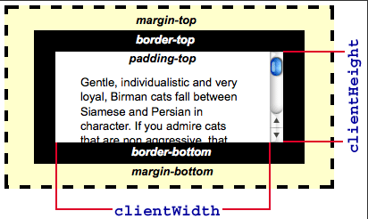
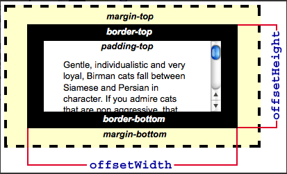
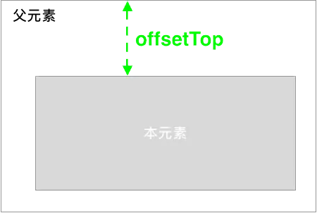
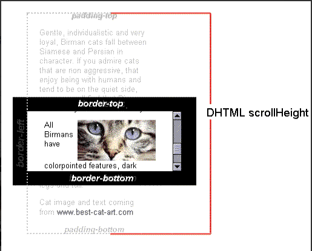
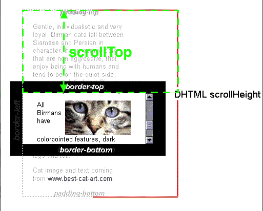
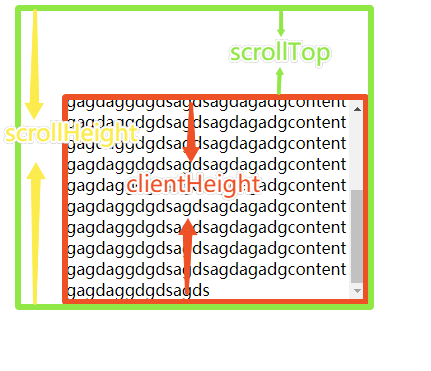

元素的位置属性一直是很容易弄混淆的地方，各种高度宽度距离，每次使用的时候都需要各种查查查。今天就将相关属性做一个归类整理，通过画图以最直观的方式展现，也方便日后查阅。

# client 相关属性

- clientWidth/clientHeight
  表示一个元素的可视区域的宽高，包含元素内容以及内边距，不包含滚动部分。
  

# offset 相关属性

- offsetWidth/offsetHeight
  表示一个元素的标准宽高，它包含了边框、内边距、元素内容以及滚动条。
  

- offsetLeft/offsetTop
  表示当前元素顶部/左边距离最近父元素顶部/左边的距离。
  

# scroll 相关属性

- scrollWidth/scrollHeight
  表示一个元素内容区域的实际大小，包括不在页面中的可滚动部分（内容和内边距）。
  

- scrollTop/scrollBottom
  表示在有滚动条的时，元素可视区域顶部距离元素顶部的距离，也就是已经滚动了多少距离。
  

# 拓展应用 - 滚动加载

示例：


代码：

```html
<!DOCTYPE html>
<html lang="en">
  <head>
    <meta charset="UTF-8" />
    <meta name="viewport" content="width=device-width, initial-scale=1.0" />
    <title>滚动加载</title>
    <style>
      .parent {
        width: 300px;
        height: 200px;
        margin: 100px auto;
        border: 1px solid #ccc;
        overflow-y: scroll;
        word-break: break-all;
      }
    </style>
  </head>
  <body>
    <div class="parent" id="target">
      <div class="child">
        gagdaggdgdsagdsagdagadgcontentgagdaggdgdsagdsagdagadgcontentgagdaggdgdsagdsagdagadgcontentgagdaggdgdsagdsagdagadgcontentgagdaggdgdsagdsagdagadgcontentgagdaggdgdsagdsagdagadgcontentgagdaggdgdsagdsagdagadgcontentgagdaggdgdsagdsagdagadgcontentgagdaggdgdsagdsagdagadgcontentgagdaggdgdsagdsagdagadgcontentgagdaggdgdsagdsagdagadgcontentgagdaggdgdsagdsagdagadgcontentgagdaggdgdsagdsagdagadgcontentgagdaggdgdsagdsagdagadgcontentgagdaggdgdsagdsagdagadgcontentgagdaggdgdsagdsagdagadgcontentgagdaggdgdsagds
      </div>
    </div>
    <script>
      let target = document.getElementById("target");
      target.addEventListener("scroll", function () {
        const clientHeight = target.clientHeight;
        const scrollTop = target.scrollTop;
        const scrollHeight = target.scrollHeight;
        if (clientHeight + scrollTop >= scrollHeight) {
          // 到底部了
          console.log("到底部了");
        }
      });
    </script>
  </body>
</html>
```
