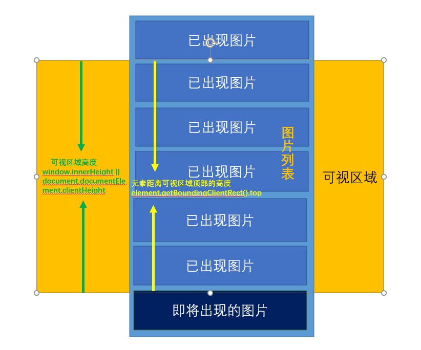

# 功能函数

## 防抖-debounce

解释：当持续触发某事件时，一定时间间隔内没有再触发事件时，事件处理函数才会执行一次，如果设定的时间间隔到来之前，又一次触发了事件，就重新开始延时。即：最后一次触发后间隔时间结束才会执行回调函数。**最后一个人说了算**。
案例：持续触发 scroll 事件，并不会立即执行延迟函数，而是当 1000 毫秒内没有触发 scroll 事件时，才会执行延迟函数。

```javascript
// 定义防抖函数
function debounce(func, ms = 1000) {
  let timer;
  return function (...args) {
    if (timer) {
      clearTimeout(timer);
    } else {
      timer = setTimeout(() => {
        func.apply(this, args);
      }, ms);
    }
  };
}
/*
 * 使用
 */
// 延迟函数
const task = () => {
  console.log("task");
};
// 初始化时执行debounce函数一次,返回一个函数
const debounceTask = debounce(task, 1000);
// 监听滚动,执行回调函数,即'返回函数'
window.addEventListener("scroll", debounceTask);
```

`注意`：
`debounce`只会初始化时执行一次，并返回一个函数赋值给`debounceTask`,因此`let timer`只会在初始化时执行一次。`addEventListener` 监听函数的第二个参数实际是 `debounce` 函数里 `return`的函数，`scroll`频繁触发`debounceTask`，不是重复执行`debounce`函数，而是会执行`debounce`函数中`return`返回的函数。

## 节流-throttle

解释：当持续触发事件时，有规律的每隔一个时间间隔执行一次事件处理函数，在这段时间内无论触发了多少次事件，只会执行第一次。**第一个人说了算**。
案例：持续触发 scroll 事件时，并不立即执行延迟函数，每隔 1000 毫秒才会执行一次延迟函数。

```javascript
// 定义节流函数
function throttle(func, ms = 1000) {
  let flag = true;
  return function (...args) {
    if (!flag) return;
    flag = false;
    setTimeout(() => {
      func.apply(this, args);
      flag = true;
    }, ms);
  };
}
/*
 * 使用
 */
const task = () => {
  console.log("task");
};
const throttleTask = throttle(task, 1000);
// scroll事件 频繁触发
window.addEventListener("scroll", throttleTask);
```

原理和防抖类似。

## 图片懒加载

解释：当页面要展示很多图片的时候，同时加载所有的图片，对性能是极大的损耗，因此通常对于列表图片的页面，都使用懒加载策略，即：不用一次性加载所有的图片，当滚动到图片位置，图片出现时再加载图片。
核心逻辑：当图片元素距离可视区域顶部的距离小于可视区域的高度时，说明图片元素露出，此时给图片元素设置 src 属性。
图示：


```javascript
// html
<div class="container">
  <div class="img">
    // 注意:我们并没有为它引入真实的src
    
  </div>
  <div class="img">
    
  </div>
  ......
</div>;
// js
// 定义懒加载函数
function lazyloadImg() {
  // 获取所有的图片标签
  const imgs = document.getElementsByTagName("img");
  // 获取可视区域的高度
  const viewHeight =
    window.innerHeight || document.documentElement.clientHeight;
  // num用于统计当前显示到了哪一张图片，避免每次都从第一张图片开始检查是否露出
  let num = 0;
  for (let i = num; i < imgs.length; i++) {
    // 可视区域的高度 - 元素距离可视区域顶部的距离
    // 如果可视区域的高度 大于等于 元素距离可视区域顶部的距离 则表示元素露出
    let distance = viewHeight - imgs[i].getBoundingClientRect().top;
    if (distance >= 0) {
      // 给元素设置真是的src，显示图片
      imgs[i].src = imgs[i].getAttribute("data-src");
      // 前i张图片已经加载完毕，下次从第i+1张开始检查是否露出
      num = i + 1;
    }
  }
}
// 监听滚动事件
window.addEventListener("scroll", lazyloadImg, false);
```

注意：此处只是演示懒加载的功能，如果在实际应用中，因为用户滚动可能会造成频繁的触发事件，因此需要加上防抖。

## 滚动加载更多

解释：在移动端中

## 深拷贝-deepCopy

## 函数柯里化

## 斐波那契数列

# JS 原生 API 实现

## call

## apply

## bind

## new

## instanceOf

## forEach()

# 设计模式
