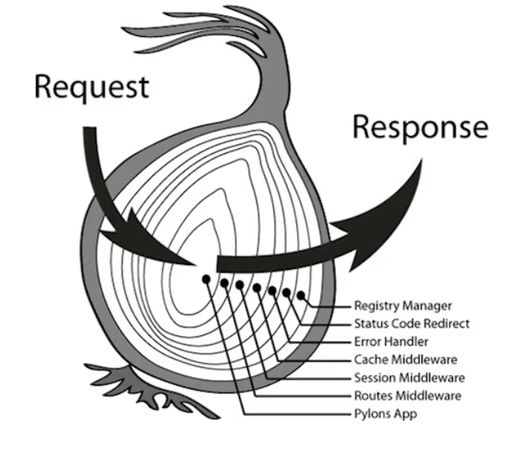

# 1. Koa的简单使用
## 1.1. 搭建第一个Koa程序
- 安装koa
```bash
npm i koa --save
```
- 搭建简易koa程序
```javascript
const Koa = require('koa')
const app = new Koa()
app.use(ctx => {
  ctx.body = 'Hello Wuzhichao'
})
app.listen(3000)
```
## 1.2. 使用nodemon管理服务
node服务启动后如果修改代码需要重启服务后才可以生效，使用nodemon可以实现修改代码不重启服务也可以生效。
- 安装nodemon
```bash
npm i nodemon -D
```
- 配置启动命令
nodemon安装成功后，使用`nodemon index.js`启动node服务，会报"找不到命令"得错误，因为不是全局安装直接使用会找不到该命令。因此需要在`package.json`的`script`中配置启动命令。
```json
"scripts": {
  "start": "nodemon index.js"
},
```
执行`npm start`即可启动成功，此时修改代码，不用重新启动node服务也会生效。

# 2. 中间件与洋葱模型 
## 2.1. 认识中间件
中间件简单的来说就是通过`app.use()`注册的一个具有特定功能的函数。示例:
```javascript
app.use(ctx => {
  console.log('abc')
})
```
上面示例中，输出`abc`这个函数就是一个中间件。
## 2.2. 多个中间件加载顺序
在`koa`中多个中间件不会同时执行。
```javascript
app.use(ctx => {
  ctx.body = 'Hello World'
})
app.use(ctx => {
  console.log('abc')
})
```
执行程序，`abc`没有输出，说明第二个中间件没有执行。原因就是因为在`koa`中多个中间件如果想要执行下一个需要通过`next`进行声明。
```javascript
// 中间件1
app.use(async (ctx,next) => {
  await next()
  console.log(1)
  ctx.body = 'Hello world'
})
// 中间件2
app.use(ctx => {
  console.log(2)
})
```
执行结果为：1 2 ，说明第二个中间件执行了。

即： 在`koa`中多个中间件时，如果想要执行下一个中间件需要通过`next`来进行声明，通过`next`声明后，下一个中间件会执行，执行完毕后再执行当前中间件后面的代码。

## 2.3. 洋葱模型
以上示例中可以看出`koa`中多个中间件时接收请求是`由外往里`，返回响应是`由里向外`的，即：洋葱模型。
请求： 中间件1 -> 中间件2
响应： 2 -> 1



# 3. 路由处理
路由：简单说就是，根据不同的请求返回不同的数据。
## 3.1. 路由的作用
- 处理不同的url
- 处理不同的http方法
- 解析请求url上的参数
## 3.2. 自己实现简单的koa路由
1. 处理不同的url
`ctx.url`:获取请求url
2. 处理不同的请求方法
`ctx.method`: 获取请求方法
3. 解析请求参数
可以通过获取`ctx.url`后通过正则匹配
- 示例：
```javascript
app.use(ctx => {
  if (ctx.url === '/') {
    ctx.body = '主页'
  } else if (ctx.url === '/users') {
    if (ctx.method === 'GET') {
       ctx.body = '用户页'
    } else if (ctx.method === 'POST') {
      ctx.body = '创建用户'
    } else {
      ctx.body = 405
    }
  }  else if (ctx.url.match(/\/users\/\w+/)) {
    const userId = ctx.url.match(/\/users\/\w+/)[1]
    ctx.body = `这是用户${userId}`
  } else {
    ctx.status = 404
  }
})
```
## 3.3. 使用koa-router实现路由
### 3.3.1. 基本使用
- 安装`koa-router`
```bash
npm i koa-router -S
```
- 使用
```javascript
const Koa = require('koa')
const Router = require('koa-router')
const app = new Koa()
const router = new Router()
// 处理不同的url
router.get('/',ctx => {
  ctx.body = '主页'
})
router.get('/users',ctx => {
  ctx.body = '用户列表'
})
// 处理不同的请求方法
router.post('/users',ctx => {
  ctx.body = '创建用户'
})
// 解析参数
router.get('/users/:id',ctx => {
  ctx.body = `用户${ctx.params.id}`
})
// 注册koa-router中间件
app.use(router.routes())
app.listen(3000)
```
### 3.3.2. 前缀
在编写路由接口的时候我们习惯同一个模块都使用统一的前缀来进行模块区分，但如果按照上面示例的写法，如果太多也不好维护，且每个接口前面都需要重复写前缀，这是不能忍的.....

在`koa-router`中，给我们提供通过设置`prefix`来管理前缀，实现同一个模块接口的集中管理。
```javascript
const Koa = require('koa')
const Router = require('koa-router')
const app = new Koa()
const router = new Router()
// 实例化用户路由
const usersRouter = new Router({prefix: '/users'})
// 处理不同的url
router.get('/',ctx => {
  ctx.body = '主页'
})
// 处理用户路由
usersRouter.get('/',ctx => {
  ctx.body = '用户列表'
})
// 处理不同的请求方法
usersRouter.post('/',ctx => {
  ctx.body = '创建用户'
})
// 解析参数
usersRouter.get('/:id',ctx => {
  ctx.body = `用户${ctx.params.id}`
})
// 注册koa-router中间件
app.use(router.routes())
app.use(usersRouter.routes())
app.listen(3000)
```

### 3.3.3. 多中间件使用
在有些场景下，接口需要进行鉴权才可以访问，这是就需要用到多个中间件。
```javascript
const Koa = require('koa')
const Router = require('koa-router')
const app = new Koa()
const router = new Router()
// 鉴权中间件
const auth = async (ctx, next) => {
  if (ctx.url !== '/users') {
    ctx.throw(401)
  }
  await next()
}
// 实例化用户路由
const usersRouter = new Router({prefix: '/users'})
// 处理不同的url
router.get('/',ctx => {
  ctx.body = '主页'
})
// 处理用户路由
usersRouter.get('/',auth,ctx => {
  ctx.body = '用户列表'
})
// 处理不同的请求方法
usersRouter.post('/',auth,ctx => {
  ctx.body = '创建用户'
})
// 解析参数
usersRouter.get('/:id',auth,ctx => {
  ctx.body = `用户${ctx.params.id}`
})
// 注册koa-router中间件
app.use(router.routes())
app.use(usersRouter.routes())
app.listen(3000)
```
### 3.3.4. allowedMethods
`allowedMethods`是用来响应`options`方法，告诉它所支持的请求方法，通过响应头`headers`中的`Allow`字段查看。
> options 请求方法是用来返回接口所支持的HTTP请求方法。

在未设置`allowedMethods`时，如果想通过`options`请求方法查看接口所支持的请求方法时，接口会报`404`，因此`options`方法未实现。

此时就需要设置`allowedMethods`。
```javascript
app.use(usersRouter.allowedMethods())
```
此时，如果在通过未实现且不支持的请求方法请求时就会报`405 Method Not Allowed`。

综合，`allowedMethods`的作用：
1. 响应`options`方法。告诉它所支持的请求方法。
2. 相应的返回`405`(不允许)和`501`(未实现)。

# 4. 控制器
控制器就是拿到路由分配的任务并执行，在koa中控制器也是一个中间件，它的作用：
1. 获取http请求参数
2. 处理业务逻辑
3. 返回不同的http响应

## 4.1. 请求参数获取
### 4.1.1 获取query
`Query String` 参数：即请求`url`中`?`后面的内容，  如：?user=zhangsan，通常跟可选参数。
- 获取方式：`ctx.query`
- 请求地址：`http://localhost:3000/users?name=张三`
- 请求处理：
```javascript
router.get('/users',ctx => {
  console.log(ctx.query.name) // 张三
})
```
### 4.1.2 获取params
`Router Params`参数： 即请求`url`中`:`后面的内容，如：/users/:id ,通常跟必选参数。
- 获取方式：`ctx.params`
- 请求地址：`http://localhost:3000/users/zhangsan`
- 请求处理：
```javascript
router.get('/users/:name',ctx => {
  console.log(ctx.params.name) // zhangsan
})
```

### 4.1.3 获取body
`Body`参数： 即放在请求体中的参数，如： {name: 'lucy'}
- 获取方式：
`Koa`本身不支持解析请求体，需要借助第三方中间件 - `koa-bodyparser`
- 请求地址：`http://localhost:3000/users`
- 请求头：Headers => { Content-Type: application/json }
- 请求体：Body => raw => application/json => { name: '李四' }
- 请求处理：
1. 安装`koa-bodyparser`
```bash
npm i koa-bodyparser --save
```
2. 注册中间件
3. 获取参数：`ctx.request.body`
```javascript
const Koa = require('koa')
const Router = require('koa-router')
const bodyparser = require('koa-bodyparser')
const app = new Koa()
const router = new Router()
router.post('/users',ctx => {
  console.log(ctx.request.body.name) // 李四
})
app.use(router.routes())
app.use(bodyparser())
app.listen(3000)
```

```javascript
router.post('/users',ctx => {
  console.log(ctx.params.name) // zhangsan
})
```
### 4.1.4 获取header
`Header`参数，即放在请求头中的参数，如`Accept、Cookie`。
获取参数：`ctx.header`

## 4.2. 返回响应数据
### 4.2.1. 返回相应状态码
`Status`，即响应状态码，如200、400等
- 设置响应状态码：
`ctx.status = 200`

### 4.2.2. 返回响应体
`Body`,即响应体，如{data: {a: 1}}
- 设置响应体：
```
ctx.body = [{name: 'zhangsan'}, {name: 'lisi'}]
```
### 4.2.3. 返回响应头
`Header`，即响应头，如`Allow、Content-Type`
- 设置响应头
```bash
ctx.set('Allow', 'GET,POST') // 设置允许的请求方法
```

## 4.3. 错误处理
错误处理，即处理程序出现的异常状况。
### 4.3.1. 常见的异常状况
- 运行时错误：运行时错误通常响应码为500

- 逻辑错误：404-找不到资源，412-先决条件失败，422-无法处理的实体，参数格式不对

### 4.3.2. koa自带的错误处理
404：自动处理，找不到资源返回404
412：手动抛出错误- `ctx.throw(412,'先决条件失败')`
500：程序内部错误，自动处理，并打印错误内容
koa默认的错误处理返回的错误都是文本。

### 4.3.3. 自己实现一个错误处理中间件
- 实现方式
在所有中间件前面注册该中间件，内部通过`try ...catch`捕获错误。
- 代码实现
```javascript
app.use(async (ctx,next) => {
  try {
    await next()
  } catch(err) {
    ctx.status = err.status || err.statusCode || 500
    // 按json格式返回
    ctx.body = {
      message: err.message 
    }
  }
}) 
```
- 缺点
无法捕获404错误

### 4.3.4. 使用koa-json-error进行错误处理
- 安装
```bash
npm i koa-json-error --save
```
- 配置
```javascript
const Koa = require('koa')
const app = new Koa()
const error = require('koa-json-error')
// 返回堆栈错误信息
app.use(error({
  postFormat:(e,{stack,...rest}) => rest
}))
```
这种方式是比较推荐的。

## 4.4. 请求参数校验 
在处理请求接口的时候，通常需要对请求参数进行校验，拿到我们所期望的参数。通常使用`koa-parameter`这个中间件进行参数校验。
- 安装
```bash
npm i koa-parameter --save
```
- 使用
```javascript
const Koa = require('koa')
const Router = require('koa-router')
const app = new Koa()
const router = new Router()
const usersRouter = new Router({prefix: '/users'})
// 引入
const parameter = require('koa-parameter')
usersRouter.post('/',ctx => {
  // 校验请求体参数
  ctx.verifyParams({
    name: { type: 'string' , required: true }
  })
  ctx.body = '创建用户'
})
app.use(usersRouter.routes())
// 注册
app.use(parameter(app))
app.listen(3000)
```

# 5. 最佳实践
在后端代码中，一般都是按照`MVC`的架构来设计代码的，即路由只负责拦截请求，业务逻辑交给控制器`controller`来处理。
```javascript
|-app
  |-controller // 控制器管理
    |-users.js
     class UserController {
       find(ctx) {}
       findById(ctx) {}
       create(ctx) {}
       update(ctx) {}
       del(ctx) {}
     }
     module.exports = new UserController();
  |-routtes // 路由管理
    |-index.js // 批量路由注册
      const fs = require('fs');
      module.exports = (app) => {
        fs.readdirSync(__dirname).forEach(file => {
          if (file === 'index.js') return;
          const route = require(`./${file}`);
          app.use(route.routes()).use(route.allowedMethods())
        })
      }
    |-users.js // 用户相关路由
      const Router = require('koa-router');
      const router = new Router({prefix: '/users'});
      const {find,findById,create,update,del}  = require('../controller/users')
      router.get('/', find)
      router.get('/:id',findById)
      router.post('/',create)
      router.put('/:id',update)
      router.delete('/:id',del)
      module.exports = router
  |-index.js // 入口文件
    const Koa = require('koa')
    const bodyparser = require('bodyparser')
    const app = new Koa()
    const registerRoutes = require('./routes')
    registerRoutes(app)
    app.listen(3000)
```