> 写 React 已经有一段时间了，从开始到现在都是一路摸爬滚打过来的，踩过不少坑。虽然学习 React 已经很久了，但是和真正写还是有很大区别的，今天就从头开始记录下使用过程的点点滴滴，权且当作学习笔记吧，也希望能给将要入坑的小伙伴一点点启示吧！

# 前言

习惯了使用`Vue`开发的小伙伴，如果突然切换到`React`技术栈，刚开始肯定会有些手足无措，因为相比`Vue`的脚手架`Vue-cli`，`React`官方提供的脚手架工具`create-react-app`则显得没有那么友好。在`Vue-cli`中，如果想要扩展`webpack`配置，只需要在项目的根目录新建一个`vue.config.js`文件，在该文件中进行配置即可。但是`create-react-app`则没有那么简单，它把所有的`webpack`配置都集成在了`react-scripts`的依赖包中，我们无法直接修改的，官方提供了一个`npm run eject`命令可以执行脚本将`react-scripts`配置释放到本地，来让我们进行配置，但这种方式也会有缺陷，具体后面会详细说明，同时，社区也提供了一种方案，可以使用`react-app-rewired`包来重写`webpack`配置。接下来我们就详细来说明这两种方式，帮你一举扫清环境配置的各种障碍。

# 使用`create-react-app`初始化项目

- 创建项目

```bash
npx create-react-app react-demo
```

- 启动项目

```bash
cd react-demo
npm run start
```

至此，一个简单的`react`项目就创建和启动完毕了。

# 扒一扒`create-react-app`背后的东西

通过项目创建大概有小伙伴会说这比`vue-cli`创建`vue`项目简单，但是两个命令背后发生了什么应该也会有疑问，接下来我们就一点点扒开它的真实面目。

**两个疑问**

**1、为什么使用`npx`创建项目？**

在使用`create-react-app`创建项目时，通常是使用如下命令：

```bash
// 全局安装create-react-app
npm install create-react-app -g
// 使用create-react-app创建项目
create-react-app react-demo
```

但是我们这里为什么使用了 npx 就可以直接创建项目呢 ?
那就要从认识`npx`说起了。
`npx`是`npm`提供的一个命令，它可以不用全局安装包文件，就可以执行命令，在使用`npx`时它会先从下载一个临时包文件，等使用完成之后就会自动删除，以避免额外的占用磁盘空间。

**2、执行`npm run start`后发生了什么？**

相比很多的小伙伴大概也会跟我一样，对于执行一个命令就启动起来项目了，这背后到底发生了什么很好奇？那么现在我们就来一起一探究竟。

首先，查看项目根目录的`package.json`文件:

```json
{
  "name": "react-demo",
  "version": "0.1.0",
  "private": true,
  "dependencies": {
    "@testing-library/jest-dom": "^5.11.4",
    "@testing-library/react": "^11.1.0",
    "@testing-library/user-event": "^12.1.10",
    "react": "^17.0.1",
    "react-dom": "^17.0.1",
    "react-scripts": "4.0.1",
    "web-vitals": "^0.2.4"
  },
  "scripts": {
    "start": "react-scripts start",
    "build": "react-scripts build",
    "test": "react-scripts test",
    "eject": "react-scripts eject"
  },
  "eslintConfig": {
    "extends": ["react-app", "react-app/jest"]
  },
  "browserslist": {
    "production": [">0.2%", "not dead", "not op_mini all"],
    "development": [
      "last 1 chrome version",
      "last 1 firefox version",
      "last 1 safari version"
    ]
  }
}
```

查看`package.json`中的`scripts`配置，我们知道了，执行`npm run start`命令其实是执行了`react-scripts start`,那么`react-scripts`又是何方圣神呢？
其实`npm`执行的命令默认都会去项目的`node_modules`下面`.bin`目录下找可执行脚本。

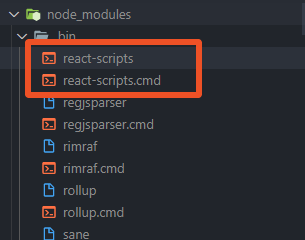
其中`react-scripts.cmd`是`windows`系统下的可执行命令，`react-script`是`linux`环境下的命令。扒开文件内容我们可以看到：
```bash
@IF EXIST "%~dp0\node.exe" (
  "%~dp0\node.exe"  "%~dp0\..\react-scripts\bin\react-scripts.js" %*
) ELSE (
  @SETLOCAL
  @SET PATHEXT=%PATHEXT:;.JS;=;%
  node  "%~dp0\..\react-scripts\bin\react-scripts.js" %*
)
```
通过上面命令我们就知道了脚手架的`webpack`配置入口文件是`react-scripts`包中`bin`目录下的`react-scripts.js`文件。
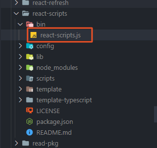
然后在入口文件中又根据执行命令(参数)不同加载`scripts`目录下不同的文件。
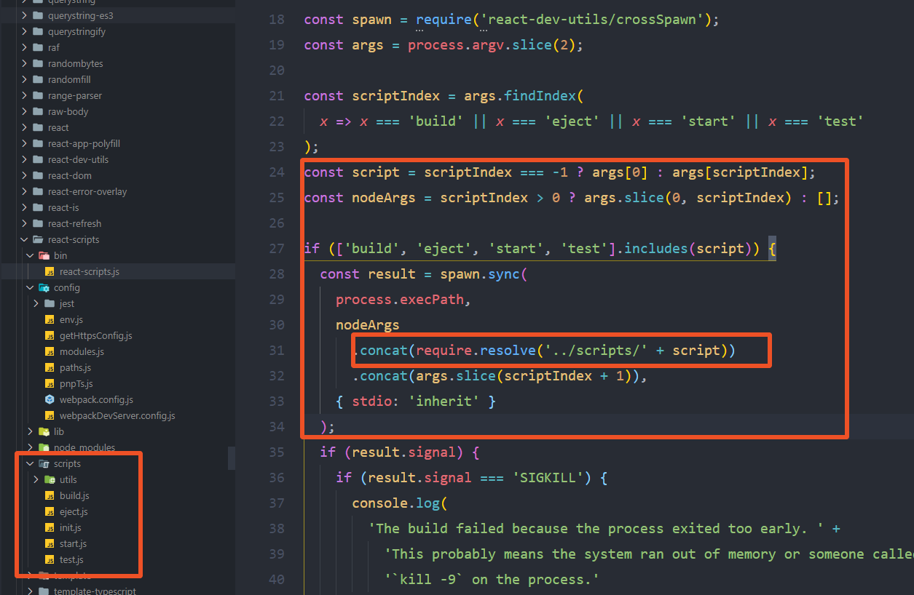
由入口文件可知，如果执行的是`npm run start`就会执行`scripts/start.js`文件。
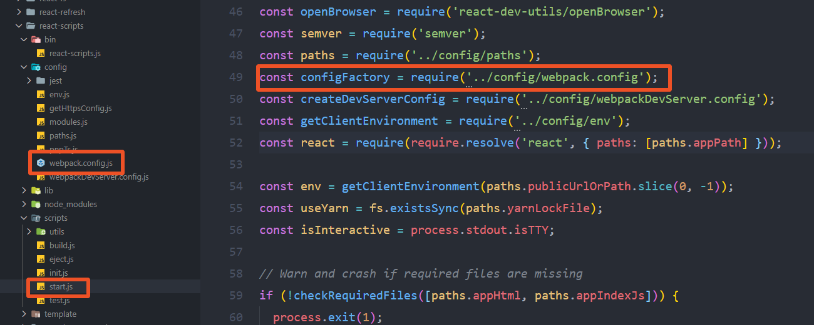
在`start.js`文件中引入了`config`目录下`webpack.config.js`文件，那么这个文件就是项目脚手架中核心的`webpack`配置文件了。

扒到这里，大概大家就明白了，服务是如何启动的了，以及脚手架背后的`webpack`是如何配置的了。

那么，接下来我们就来说一说在日常项目中我们通常都怎样在脚手架的基础上自定义`webpack`配置的。

# 自定义`webpack`配置

通常，脚手架生成的默认配置是很难满足我们项目需要的，因此自定义配置项目的`webpack`是我们无法避免的。接下来我就介绍两种自定义`webpack`的方式。以及日常开发中常用到的配置。

## 一、使用`eject`，释放默认`webpack`配置

在`package.json`文件的`scripts`命令中，有一个`npm run eject`的命令，这个是`create-react-app`官方提供了一个可以释放默认`webpack`的命令。

执行`npm run eject`命令会将`react-scripts`释放到本地项目中，可以通过修改对应的文件完成配置。同时会删除`react-scripts`依赖包，修改`package.json`中命令。
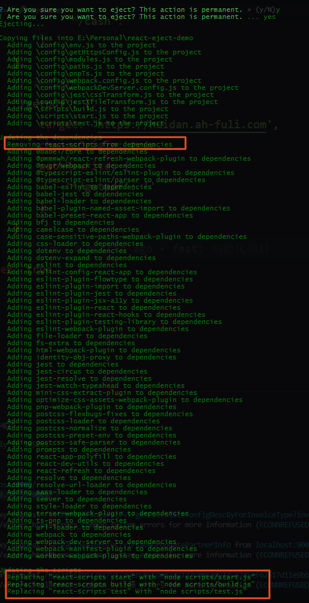

命令执行完毕以后，我们就会看到本地项目中多出了`scripts`和`config`两个目录文件。同时，`package.json`文件命令也被修改了。

```json
"scripts": {
    "start": "node scripts/start.js",
    "build": "node scripts/build.js",
    "test": "node scripts/test.js"
}
```

此时，如果在执行启动或者打包命令，就是直接执行的`scripts`目录下对应的文件了。我们可以很方便的根据需要修改对应的文件配置即可。

但值得注意的是，`npm run eject`命令是不可逆的，即执行之后不可恢复，这就造成了如果后续我们想通过脚手架的`react-scripts`包增加新的特性，比如`PWA`支持，是不可行的，因此，请根据需要谨慎释放。

说完如何释放脚手架的`webpack`配置，接下来我们就来说一下如何通过释放默认配置的方式进行一些**常用的自定义配置**。

### 添加`less`支持

- **安装`less`和`less-loader`**

```bash
npm install less less-loader
```

- **在`config/webpack.config.js`文件中做如下配置：**

  **1、添加匹配`.less`和`.module.less`结尾的文件的正则**
  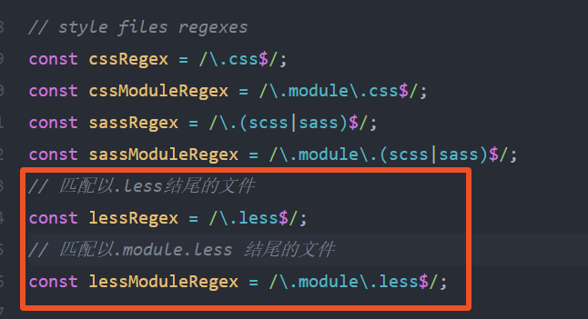

  **2、在`module`的`rules`中配置`less-loader`规则**

  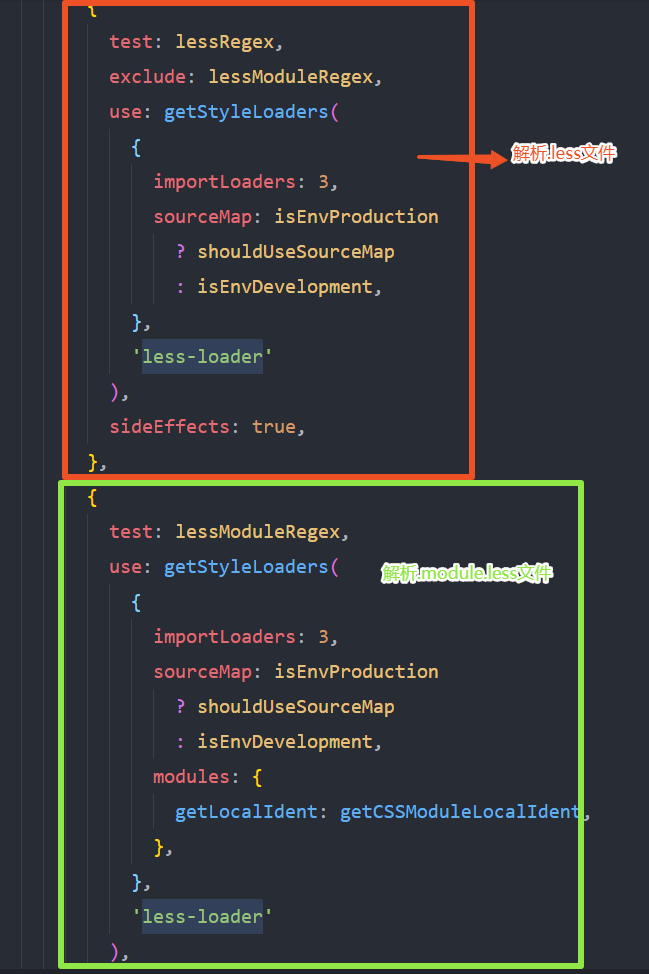
  至此，对`less`文件的支持已经配置好了，在项目中创建`less`样式文件并引入，就可以生效了。

- **拓展**

  看了上面的配置，可能有些人会有疑问：
  **为什么要在配置中匹配`.module.less`文件，并进行单独的解析？**

  这是因为在`create-react-app`创建的项目中，组件中的样式没有作用域隔离的概念，不像是`vue`中给`style`添加`scoped`属性，样式文件只针对当前组件有效，不会影响到子组件。所以在`react`项目中如果不进行处理很容易造成全局样式污染的问题。

  针对此，通常有两种解决方案：
  1、每个组件在最外层标签上都定义一个唯一的类名，所有的样式写在这个类下面。但是该方式当项目大了，参入人员多了就很难把控。
  2、定义组件样式文件为`组件名.module.less`的形式，并以模块的方式引入。
  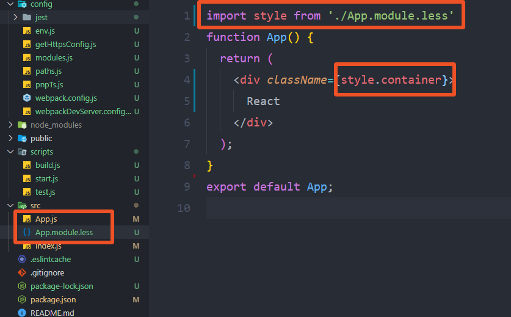
  解析到页面的时候就会给对应标签添加一个唯一标志的类名，这样就可以有效的避免样式污染问题。
  

### 按需引入 Antd 组件

`antd`组件是使用`React`技术栈使用最为普遍的 UI 组件库，如果使用`css`书写样式，那么按照官方文档配置使用即可：
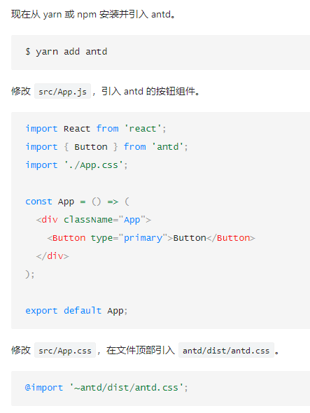

但是，如果我们使用`less`作为样式书写方式，使用上面的方式，`antd`的样式文件会不生效，如果将在`App.less`顶部引入的`antd`样式文件改为`antd.less`则会报错，因为在`antd`的`dist`目录下根本就找不到`antd.less`文件。

那么，我们就需要借助`babel-plugin-import`这个加插件了，使用这个插件在按需引入组件的时候会自动引入`.js`和`.css|.less`文件。
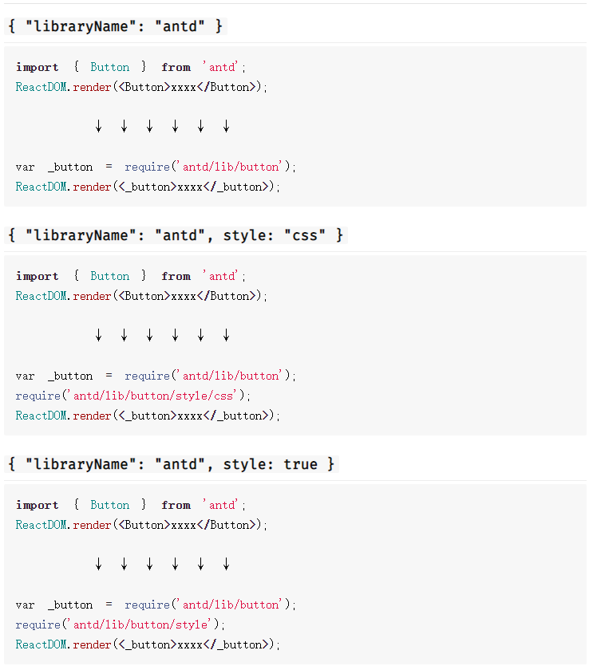
接下来，就需要安装和配置`babel-plugin-import`了

- 安装

```bash
npm install babel-plugin-import
```

- 配置

在`package.json`文件中配置`babel`:

```json
"babel": {
    "presets": [
      "react-app"
    ],
    "plugins": [["import",{
        "libraryName": "antd",
        "libraryDirectory": "es",
        "style": true
    }]]
  }
```

或者在根目录创建`.babelrl`文件，配置：

```json
// .babelrl
{
  "babel": {
    "presets": [
      "react-app"
    ],
    "plugins": [
      ["import", {
        "libraryName": "antd",
        "libraryDirectory": "es",
        // css
        // "style": "css"
        //less
        "style": true
      }]
    ]
}
```

以上两种配置`babel`的方式取一种即可。

另外需要提及一下的是，以上配置`style`取值不同，加载的样式文件类型也不一样。
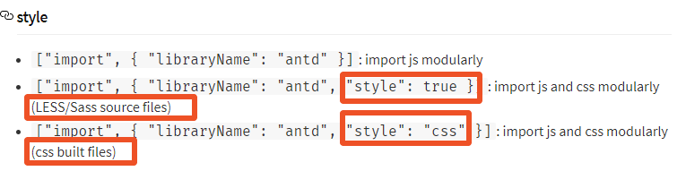

- 踩坑
  配置`style: true`时，如果使用`less`和`less-loader`较高版本时会报错，在一番尝试后，将版本降级即可。我这里使用如下版本：

  ```bash
  "less": "2.7.3",
  "less-loader": "5.0.0",
  ```

  当然，经过探索，使用高版本的`less-loader`也是可以的，但是`less`的版本要匹配，我这里使用了`less-loader`最新版本`7.1.0`,通过查看`less-loader`配置文件，发现依赖的`less`版本是`3.5.0`,因此我将`less`版本降为了对应版本。可光这样还是不够，还需要对`webpack`的`less-loader`进行对应的配置。
  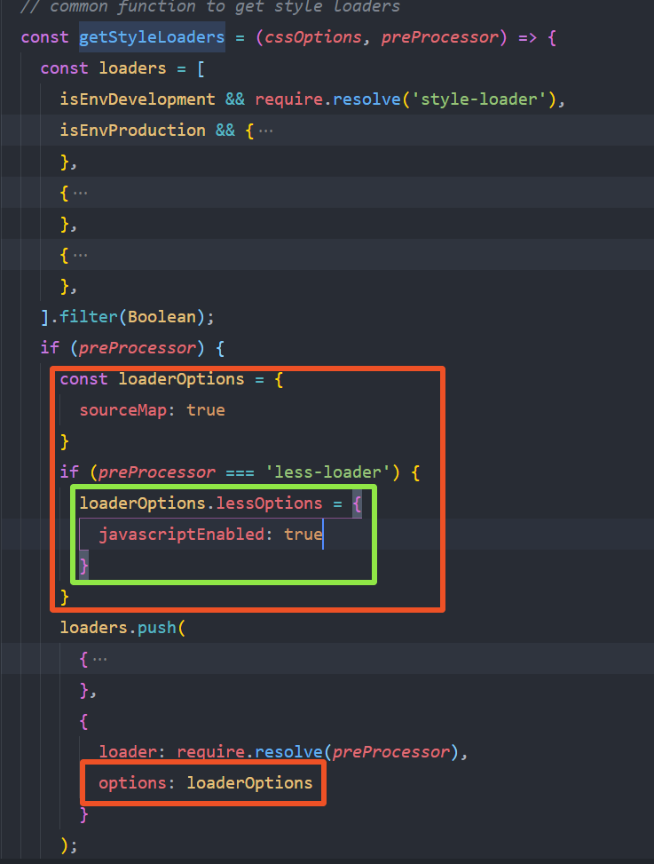

### 自定义 Antd 主题

搞定上面的`less-loader`配置以后，自定义主题就非常容易了。`antd`组件样式是使用`less`开发的，我们只需要使用`less`提供的 `modifyVars` 的方式进行覆盖变量即可。
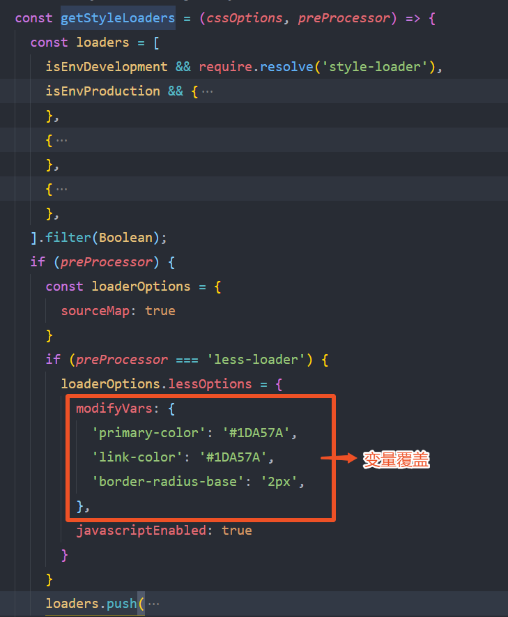

### 配置跨域

跨域是前后端分离的开发方式绕不过去的问题，因此也是我们进行项目开发时首先要考虑的，`React`开发的跨域配置有别于`Vue`，下面我们就来详细的看看。
通过阅读`create-react-app`[官方文档]("https://create-react-app.dev/docs/proxying-api-requests-in-development/#configuring-the-proxy-manually")可知，有两种方式可以配置跨域：

**1、在`package.json`中，`proxy`字段进行配置：**

```json
"proxy": "http://192.168.0.0/api"
```

这时，如果访问后端接口本地的`localhost`就会被代理到`http://192.168.0.0/api`上。

但是，这种方式存在一个缺陷，如果你想同时访问多台服务器这种方式就没办法满足了，类似如下配置：

```json
// 伪代码
"proxy": {
    "/api": {
        "target": "http://192.168.0.0",
    },
    "/abc": {
        "target": "http://192.168.0.1",
    }
}
```

此时，启动就会报错，提示`proxy`字段只接收字符串，不接受对象。

**2、针对第一种的缺陷，官方比较推荐使用 `http-proxy-middleware`插件的方式**
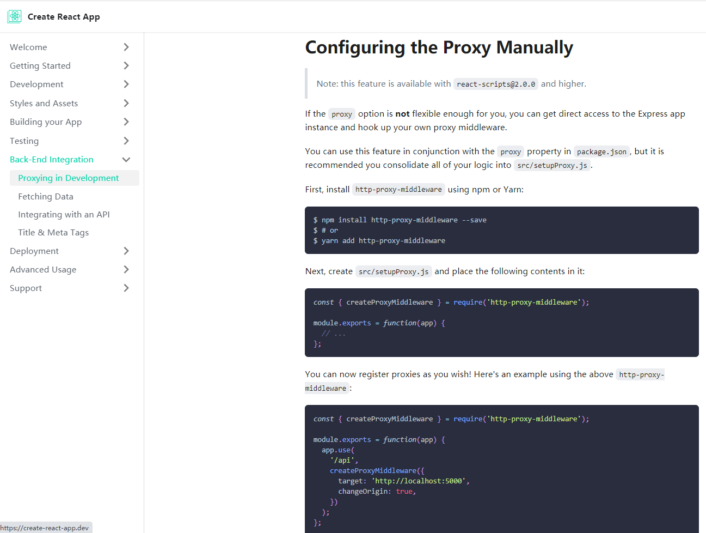

具体使用如下：

- 安装`http-proxy-middleware`

```bash
yarn add http-proxy-middleware
```

- 在项目的`src`目录下创建`setupProxy.js`,并进行配置

```javascript
const { createProxyMiddleware } = require('http-proxy-middleware');
module.exports = function (app) {
    app.use(
        '/api',
        createProxyMiddleware({
            target: 'http://172.16.0.0:8082',
            changeOrigin: true,
        })
    ),
    app.use(
        '/abc',
        createProxyMiddleware({
            target: 'http://172.16.0.1:8082',
            changeOrigin: true,
        })
    ),
}
```

然后重启项目，就可以了。

### 设置路径别名

在`config`目录下找到`webpack.config.js`文件，做如下配置即可：
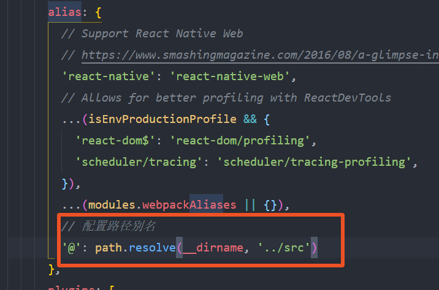

### 关闭生产环境 sourcemap

通常在开发的时候，我们会配置开发环境生成 sourcemap 文件，方便调试，但是在生产环境都要关闭，避免代码泄露和打包多余文件，体积太大。通过查看`config/webpack.config.js`文件的`devtool`配置如下：
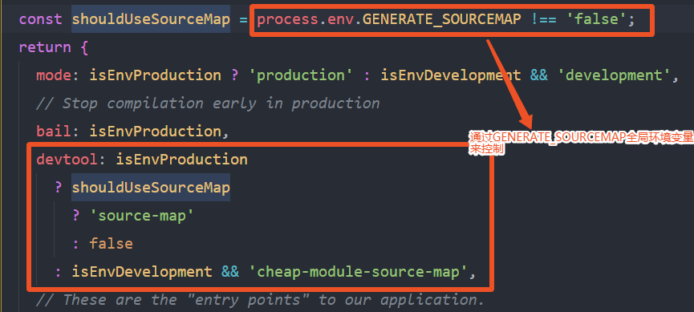
因此，可以通过`cross-env`插件在打包命令中添加全局变量。

- 安装`cross-env`

```bash
yarn add cross-env
```

- 在打包命令中配置

```bash
"scripts": {
    "build": "cross-env GENERATE_SOURCEMAP=false node scripts/build.js",
  },
```

### 打包开启 gzip 压缩

前端代码打包开启`gzip`压缩是前端性能优化重要的策略之一，因此这里也说下`eject`后如何配置打包开启`gzip`压缩。开启打包代码压缩需要使用到插件`compression-webpack-plugin`。

- 安装

```bash
yarn add compression-webpack-plugin
```

- 配置

在`config/webpack.config.js`文件下做如下配置：

```javascript
const CompressionPlugin = require("compression-webpack-plugin");
// 在命令中添加一个GENERATE_GZIP环境变量控制是否开启打包压缩
const isGzip = process.env.GENERATE_GZIP === "true";
plugins: [
  // ...
  isEnvProduction &&
    isGzip &&
    new CompressionPlugin({
      // 匹配开启gzip压缩的文件
      test: /\.(js|css|html|png|jpg)$/,
      // 压缩后静态资源文件名
      filename: "[path][base].gz",
      // 使用的压缩算法
      algorithm: "gzip",
      // 只处理10M以上的资源压缩
      threshold: 10240,
      // 只处理压缩率小于0.8的资源
      minRatio: 0.8,
      // 压缩后是否删除源文件
      deleteOriginalAssets: true,
    }),
];
```

- 在命令脚本设置是否开启压缩打包变量

```bash
"scripts": {
    "test": "cross-env GENERATE_GZIP=true node scripts/build.js",
    "prod": "cross-env GENERATE_GZIP=true node scripts/build.js"
  },
```

### 配置全局环境变量

在`create-react-app`[官方文档](https://create-react-app.dev/docs/adding-custom-environment-variables#adding-development-environment-variables-in-env)中提供了通过`.env`文件来配置全局环境变量的方式，但是只提供了开发环境和生产环境两种，但是我们日常开发中，必定会有测试环境，甚至是体验环境，因此仅仅使用官方提供的无法满足我们的需求，因此需要做些小的修改。
**需求：**
打包后的文件名通过`.env.xx`环境变量`REACT_APP_MODE`来决定。
**步骤：**

1. 在项目根目录创建三个文件：`.env`、`.env.test`、`.env.prod`。内容如下:

```javascript
// .env 开发环境环境变量
NODE_ENV = development;
REACT_APP_MODE = dev;
// .env.test 测试环境环境变量
NODE_ENV = production;
REACT_APP_MODE = test;
// .env.prod 生产环境环境变量
NODE_ENV = production;
REACT_APP_MODE = prod;
```

2. 修改`package.json`文件命令脚本

```json
"scripts": {
    "start": "node scripts/start.js",
    "test": "cross-env MODE_ENV=test node scripts/build.js",
    "prod": "cross-env MODE_ENV=prod node scripts/build.js"
  },
```

3. 修改 config/env.js 文件

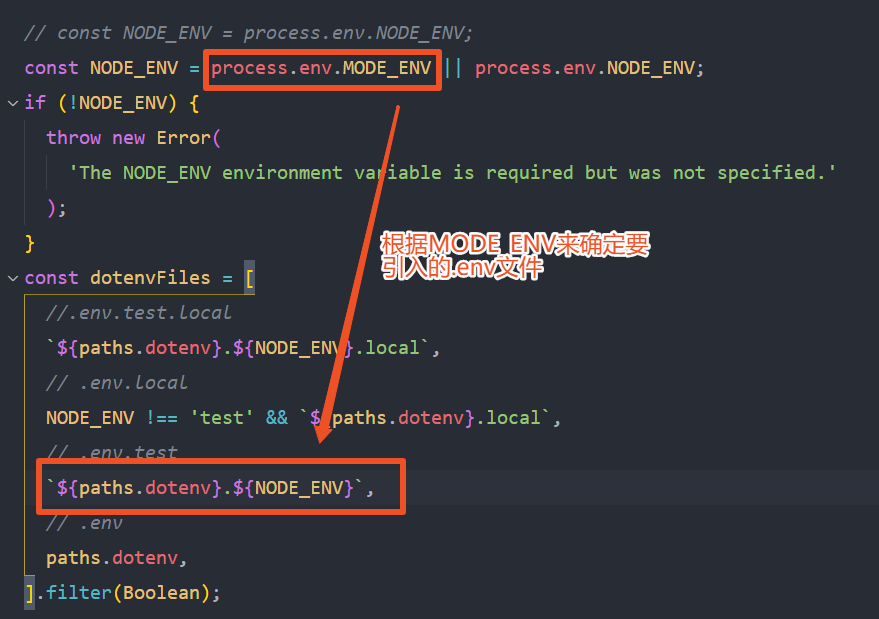

4. 修改`config/paths.js`文件

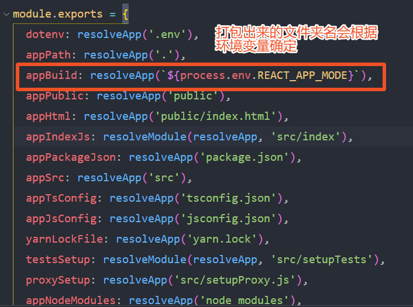

**几点说明**

- 在命令脚本设置环境变量使用了`cross-env`插件，因此需要先安装。
- 在命令脚本加入`MODE_ENV`环境变量是为了根据命令加载不同的`.env.xx`环境变量文件。
- `.env.xx`配置的环境变量必须以`REACT_APP_xx`开头。
- 在`.env.xx`配置的环境变量在全局范围内通过`process.env.变量名`获取到。

## 二、不使用`eject`，重写项目默认`webpack`配置

相比于`eject`释放配置后，需要进行复杂的`webpack`配置不同，不使用`eject`则简单很多，`添加less支持`、`Antd组件按需引入`、`自定义主题`、`跨域配置`、`设置路径别名`、`打包开启 gzip 压缩`、`生产环境关闭 sourceMap`等都可以通过插件`react-app-rewired、customize-cra`在一个配置文件内完成，**同时还支持自定义扩展，根据需求配置（添加或修改）`webpack`的`plugins`和`loader`**。具体操作如下:

**安装依赖**

```bash
yarn add react-app-rewired customize-cra babel-plugin-import less less-loader antd
```

**修改`package.json`命令配置**

```json
"scripts": {
    "start": "react-app-rewired start",
    "build": "react-app-rewired build"
}
```

**在项目根目录创建`config-overrides.js`文件，并进行如下配置：**

```javascript
const {
  override,
  overrideDevServer,
  fixBabelImports,
  addLessLoader,
  addWebpackAlias,
} = require("customize-cra");
const path = require("path");
const CompressionPlugin = require("compression-webpack-plugin");
const devServerConfig = () => (config) => {
  return {
    ...config,
    // 跨域配置
    proxy: {
      "/api": {
        target: "http://172.16.15.50:8082/api",
        secure: false,
        changeOrigin: true,
        pathRewrite: {
          "^/api": "",
        },
      },
      "/abc": {
        target: "http://172.16.0.1:9003",
        secure: false,
        changeOrigin: true,
        pathRewrite: {
          "^/abc": "",
        },
      },
    },
  };
};
// 自定义插件配置
const selfPlugins = [
  new CompressionPlugin({
    // 匹配开启gzip压缩的文件
    test: /\.(js|css|html|png|jpg)$/,
    // 压缩后静态资源文件名
    filename: "[path][base].gz",
    // 使用的压缩算法
    algorithm: "gzip",
    // 只处理10M以上的资源压缩
    threshold: 10240,
    // 只处理压缩率小于0.8的资源
    minRatio: 0.8,
    // 压缩后是否删除源文件
    deleteOriginalAssets: true,
  }),
  // 更多自定义插件配置.....
];
module.exports = {
  // webpack配置
  webpack: override(
    // 按需引入antd组件
    fixBabelImports("import", {
      libraryName: "antd",
      libraryDirectory: "es",
      style: true,
    }),
    // 添加less支持和自定义主题
    addLessLoader({
      lessOptions: {
        modifyVars: { "@primary-color": "#1DA57A" },
        javascriptEnabled: true,
      },
    }),
    // 设置路径别名
    addWebpackAlias({
      "@": path.resolve(__dirname, "./src"),
    }),
    /**暴露webpack的配置
     * 当插件内置方法不足以满足我们的要求时，可以接收一个函数来暴露webpack所有配置，
     * 进行添加或修改loader，plugins，如此就可以满足所有的需求了
     */
    (config) => {
      console.log("config", config);
      // 开发环境开启source map，生产环境去掉map文件
      config.devtool =
        config.mode === "development" ? "cheap-module-source-map" : false;
      /**
       * 添加或修改plugins配置
       */
      if (process.env.NODE_ENV === "production") {
        // 生产环境开启gzip压缩
        config.plugins = [...config.plugins, ...selfPlugins];
      }
      /**
       * 添加和修改loader配置
       */
      // 获取所有的loader信息：
      let loaders = config.module.rules.find((rule) =>
        Array.isArray(rule.oneOf)
      ).oneOf;
      // 获取到所有的loader之后，根据需求添加或修改具体的某一项loader.....
      return config;
    }
  ),
  // 本地服务devServer配置
  devServer: overrideDevServer(devServerConfig()),
};
```

**几点说明：**

1. 添加`less`支持会根据`less`和`less-loader`版本不同会有所差异，我这里使用的版本是：`"less": "3.5.0"`、`"less-loader": "^7.1.0"`。
2. 这种配置`less`支持的方式，不管是直接使用`.less`文件书写样式，还是通过`.module.less`文件的方式都可以支持。
3. 跨域代理配置这并不是唯一的方法，也可以使用前面介绍到的`http-proxy-middleware`插件。
4. 使用`compression-webpack-plugin`开启`gzip`压缩时，如果使用最新版本打包时会报错，版本降为`6.0.0`后正常。
   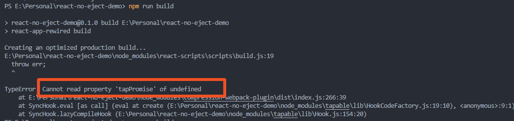
5. 这种方式，除了使用插件内置的方法配置外，还支持自定义扩展配置，通过暴露`webpack`的配置来完成自定义添加或修改`plugins`和`loader`，这样就可以最大限度来满足项目的多样化需求了。

#### 环境变量配置差异

相较于释放`webpack`配置配置环境变量，重写`webpack`配置设置环境变量则有所不同，我们无法在`config-overrides.js`中配置根据环境引入不同的`.env.xx`文件。因此只能借助工具来完成，通过`dotenv`插件我们可以在命令脚本配置引入哪个`.env.xx`文件。我们用同样的需求演示。
**需求:**
打包后的文件名通过`.env.xx`环境变量`REACT_APP_MODE`来决定。
**步骤:**

- 安装`dotenv-cli`

```bash
yarn add dotenv-cli
```

- 在项目根目录下创建`.env`、`.env.test`、`.env.prod`文件，并进行如下配置：

```javascript
// .env 开发环境环境变量
REACT_APP_MODE = dev;
// .env.test 测试环境环境变量
REACT_APP_MODE = test;
// .env.prod 生产环境环境变量
REACT_APP_MODE = prod;
```

- 修改`package.json`文件命令脚本

```json
"scripts": {
    "start": "react-app-rewired start",
    "test": "dotenv -e .env.test react-app-rewired build",
    "prod": "dotenv -e .env.prod react-app-rewired build"
}
```

- 在`config-overrides.js`中修改默认打包后的文件名
  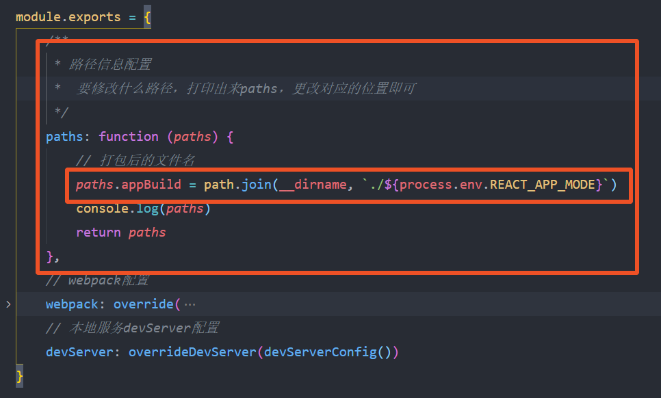

**完整配置文件**

```javascript
const {
  override,
  overrideDevServer,
  fixBabelImports,
  addLessLoader,
  addWebpackAlias,
} = require("customize-cra");
const path = require("path");
const CompressionPlugin = require("compression-webpack-plugin");
const devServerConfig = () => (config) => {
  return {
    ...config,
    // 跨域配置
    proxy: {
      "/api": {
        target: "http://172.16.15.50:8082/api",
        secure: false,
        changeOrigin: true,
        pathRewrite: {
          "^/api": "",
        },
      },
      "/abc": {
        target: "http://172.16.0.1:9003",
        secure: false,
        changeOrigin: true,
        pathRewrite: {
          "^/abc": "",
        },
      },
    },
  };
};
// 自定义插件配置
const selfPlugins = [
  new CompressionPlugin({
    // 匹配开启gzip压缩的文件
    test: /\.(js|css|html|png|jpg)$/,
    // 压缩后静态资源文件名
    filename: "[path][base].gz",
    // 使用的压缩算法
    algorithm: "gzip",
    // 只处理10M以上的资源压缩
    threshold: 10240,
    // 只处理压缩率小于0.8的资源
    minRatio: 0.8,
    // 压缩后是否删除源文件
    deleteOriginalAssets: true,
  }),
  // 更多自定义插件配置.....
];
module.exports = {
  /**
   * 路径信息配置
   *  要修改什么路径，打印出来paths，更改对应的位置即可
   */
  paths: function (paths) {
    // 打包后的文件名
    paths.appBuild = path.join(__dirname, `./${process.env.REACT_APP_MODE}`);
    console.log(paths);
    return paths;
  },
  // webpack配置
  webpack: override(
    // 按需引入antd组件
    fixBabelImports("import", {
      libraryName: "antd",
      libraryDirectory: "es",
      style: true,
    }),
    // 添加less支持和自定义主题
    addLessLoader({
      lessOptions: {
        modifyVars: { "@primary-color": "#1DA57A" },
        javascriptEnabled: true,
      },
    }),
    // 设置路径别名
    addWebpackAlias({
      "@": path.resolve(__dirname, "./src"),
    }),
    /**暴露webpack的配置
     * 当插件内置方法不足以满足我们的要求时，可以接收一个函数来暴露webpack所有配置
     * 进行添加或修改loader，plugins，如此就可以满足所有的需求了
     */
    (config) => {
      // console.log('config', config)
      // 开发环境开启source map，生产环境去掉map文件
      config.devtool =
        config.mode === "development" ? "cheap-module-source-map" : false;
      /**
       * 添加或修改plugins配置
       */
      if (process.env.NODE_ENV === "production") {
        // 生产环境开启gzip压缩
        config.plugins = [...config.plugins, ...selfPlugins];
      }
      /**
       * 添加和修改loader配置
       */
      // 获取所有的loader信息
      let loaders = config.module.rules.find((rule) =>
        Array.isArray(rule.oneOf)
      ).oneOf;
      // 获取到所有的loader之后，根据需求添加或修改具体的某一项loader.....
      return config;
    }
  ),
  // 本地服务devServer配置
  devServer: overrideDevServer(devServerConfig()),
};
```

至此，项目开发中的常用配置就已经分享完了，搭建好环境后就可以愉快的撸码了。

码字不易，且行且珍惜！！！！
