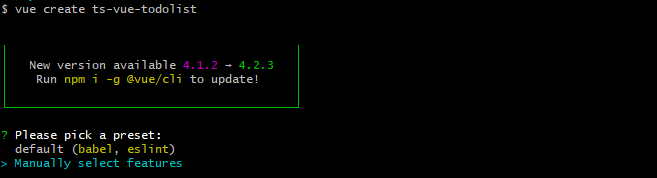

#### 全局安装`vue`脚手架
```bash
npm install -g @vue/cli
```
目前默认安装的是`vue/cli`的最新4.0版本，可使用如下命令查看：
```bash
vue --version 
```

#### 使用vue@cli 4.0初始化项目
```bash
vue create ts-vue-music
```
* 选择配置模式(自动/手动)



> 默认是自动，我们选择手动模式

* 选择集成配置项


> 使用上下方向键选择，空格键选中/取消

```bash
? Check the features needed for your project:
 (*) Babel 是否开启babel编译
 (*) TypeScript 是否集成TS
 ( ) Progressive Web App (PWA) Support  是否支持PWA
 (*) Router  是否集成vue-router
 (*) Vuex  是否集成vuex
 (*) CSS Pre-processors  是否使用css预处理
 (*) Linter / Formatter  是否规范代码类型
 ( ) Unit Testing  是否使用单元测试
 ( ) E2E Testing   是否使用E2E测试
```
* 继续选择配置项


```bash
//是否使用class风格的组件语法
? Use class-style component syntax? Yes  
//是否使用babel做转义
? Use Babel alongside TypeScript (required for modern mode, auto-detected polyfills, transpiling JSX)? Yes  
//是否使用路由history模式
? Use history mode for router? (Requires proper server setup for index fallback in production) Yes  
//选择css预处理类型，我们选择node-sass
? Pick a CSS pre-processor (PostCSS, Autoprefixer and CSS Modules are supported by default): Sass/SCSS (with node-sass)  
//选择代码规范校验工具，我们选择ESLint + Prettier
? Pick a linter / formatter config: Prettier  
//选择保存时校验
? Pick additional lint features: (Press <space> to select, <a> to toggle all, <i> to invert selection)Lint on save  
// 选择 Babel, ESLint, etc.等配置的保存位置，我们选package.json 文件
? Where do you prefer placing config for Babel, ESLint, etc.? In package.json 
// 选择是否保存这些配置到以后项目中
? Save this as a preset for future projects? Yes
```
选择完毕后就开始拉取配置，生成初始化项目文件。

* 启动项目
```bash
cd ts-vue-music // 进入项目根目录
npm run serve // 运行项目
```
项目启动后，在浏览器输入对应的地址就可以看到界面了。

#### 改造项目结构
> 使用脚手架初始化后会默认生成一个项目结构目录，但我们可以根据自己的项目需求进行改造。

* 调整项目结构目录
```bash
|—— public              入口html文件
|—— src                 源文件目录
  |—— apis              请求api
  |—— assets            静态资源
  |—— components        公共组件
  |—— directives        自定义指令
  |—— filters           过滤器
  |—— mixins            mixin混入
  |—— router            vue-router路由
  |—— store             vuex状态管理
  |—— styles            样式
  |—— types             类型声明
  |—— utils             工具方法
  |—— views             页面组件
  |—— App.vue           入口页面
  |—— main.ts           入口文件
  |—— shims-tsx.d.ts    tsx声明文件
  |—— shims-vue.d.ts    vue声明文件
|—— .gitignore          git忽略文件配置
|—— babel.config.js     babel配置
|—— package.json        依赖配置
|—— README.md           项目readme文件
|—— tsconfig.json       ts配置
|—— vue.config.js       webpack配置        
```

* 新增`vue.config.js`配置文件
> `vue-cli`脚手架默认生成的项目是零`webpack`配置的，但是零配置功能比较弱，`@vue-cli`支持自定义`webpack`配置，在根目录新建`vue.config.js`文件，这个文件会被`@vue/cli-service` 自动加载。常用配置如下：
```javascript
const path = require("path");
const sourceMap = process.env.NODE_ENV === "development";

module.exports = {
  // 基本路径
  publicPath: "./",
  // 输出文件目录
  outputDir: "dist",
  // eslint-loader 是否在保存的时候检查
  lintOnSave: false,
  // webpack配置
  // 参考 https://github.com/vuejs/vue-cli/blob/dev/docs/webpack.md
  chainWebpack: () => {},
  configureWebpack: config => {
    if (process.env.NODE_ENV === "production") {
      // 为生产环境修改配置
      config.mode = "production";
    } else {
      // 为开发环境修改配置
      config.mode = "development";
    }

    Object.assign(config, {
      // 开发生产共同配置
      resolve: {
        extensions: [".js", ".vue", ".json", ".ts", ".tsx"],
        alias: {
          vue$: "vue/dist/vue.js",
          "@": path.resolve(__dirname, "./src"),
          "@c": path.resolve(__dirname, "./src/components")
        }
      }
    });
  },
  // 生产环境是否生成 sourceMap 文件
  productionSourceMap: sourceMap,
  // css相关配置
  css: {
    // 是否使用css分离插件 ExtractTextPlugin
    extract: true,
    // 开启 CSS source maps?
    sourceMap: false,
    // css预设器配置项
    loaderOptions: {},
    // 设置为 false 后你就可以去掉文件名中的 .module 并将所有的 *.(css|scss|sass|less|styl(us)?)
    requireModuleExtension: false
  },
  // use thread-loader for babel & TS in production build
  // enabled by default if the machine has more than 1 cores
  parallel: require("os").cpus().length > 1,
  // PWA 插件相关配置
  // see https://github.com/vuejs/vue-cli/tree/dev/packages/%40vue/cli-plugin-pwa
  pwa: {},
  // webpack-dev-server 相关配置
  devServer: {
    open: true,// 启动后自动打开浏览器
    host: "localhost",
    port: 9002, ,
    https: false,
    hotOnly: false,
    proxy: {
      // 设置代理
      // proxy all requests starting with /api to jsonplaceholder
      "/api": {
        target: "http://localhost:3000/",
        changeOrigin: true,
        ws: true,
        pathRewrite: {
          "^/api": ""
        }
      }
    },
    before: app => {}
  },
  // 第三方插件配置
  pluginOptions: {
    // ...
  }
};
```
至此，一套完整的`Vue`+`TypeScript`的开发环境就搭建完成了。接下来就可以愉快的进行项目开发了。