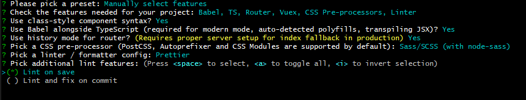

`TypeScript`是国内外前端技术圈被评为2020年最受欢迎的技术之一，如果你还没开始学，是不是就out了呢？今天我们就开始`TypeScript`+`Vue`项目开发的探索，带你体验完全不一样的`Vue`开发方式。话不多说，让我们开始吧......

# 1、初始化项目及环境搭建
## 1.1、全局安装`vue`脚手架
```bash
npm install -g @vue/cli
```
目前默认安装的是`vue/cli`的最新4.0版本，可使用如下命令查看：
```bash
vue --version 
```

## 1.2、使用vue@cli 4.0初始化项目
```bash
vue create ts-vue-music
```
* 选择配置模式(自动/手动)


> 默认是自动，我们选择手动模式

* 选择集成配置项


> 使用上下方向键选择，空格键选中/取消

```bash
? Check the features needed for your project:
 (*) Babel 是否开启babel编译
 (*) TypeScript 是否集成TS
 ( ) Progressive Web App (PWA) Support  是否支持PWA
 (*) Router  是否集成vue-router
 (*) Vuex  是否集成vuex
 (*) CSS Pre-processors  是否使用css预处理
 (*) Linter / Formatter  是否规范代码类型
 ( ) Unit Testing  是否使用单元测试
 ( ) E2E Testing   是否使用E2E测试
```
* 继续选择配置项



```bash
//是否使用class风格的组件语法
? Use class-style component syntax? Yes  
//是否使用babel做转义
? Use Babel alongside TypeScript (required for modern mode, auto-detected polyfills, transpiling JSX)? Yes  
//是否使用路由history模式
? Use history mode for router? (Requires proper server setup for index fallback in production) Yes  
//选择css预处理类型，我们选择node-sass
? Pick a CSS pre-processor (PostCSS, Autoprefixer and CSS Modules are supported by default): Sass/SCSS (with node-sass)  
//选择代码规范校验工具，我们选择ESLint + Prettier
? Pick a linter / formatter config: Prettier  
//选择保存时校验
? Pick additional lint features: (Press <space> to select, <a> to toggle all, <i> to invert selection)Lint on save  
// 选择 Babel, ESLint, etc.等配置的保存位置，我们选package.json 文件
? Where do you prefer placing config for Babel, ESLint, etc.? In package.json 
// 选择是否保存这些配置到以后项目中
? Save this as a preset for future projects? Yes
```
选择完毕后就开始拉取配置，生成初始化项目文件。

* 启动项目
```bash
cd ts-vue-todolist // 进入项目根目录
npm run serve // 运行项目
```
项目启动后，在浏览器输入对应的地址就可以看到界面了。

## 1.3、改造项目结构
> 使用脚手架初始化后会默认生成一个项目结构目录，但我们可以根据自己的项目需求进行改造。

* 调整项目结构目录
```bash
|—— public              入口html文件
|—— src                 源文件目录
  |—— apis              请求api
  |—— assets            静态资源
  |—— components        公共组件
  |—— directives        自定义指令
  |—— filters           过滤器
  |—— mixins            mixin混入
  |—— router            vue-router路由
  |—— store             vuex状态管理
  |—— styles            样式
  |—— types             类型声明
  |—— utils             工具方法
  |—— views             页面组件
  |—— App.vue           入口页面
  |—— main.ts           入口文件
  |—— shims-tsx.d.ts    tsx声明文件
  |—— shims-vue.d.ts    vue声明文件
|—— .gitignore          git忽略文件配置
|—— babel.config.js     babel配置
|—— package.json        依赖配置
|—— README.md           项目readme文件
|—— tsconfig.json       ts配置
|—— vue.config.js       webpack配置        
```

* 新增`vue.config.js`配置文件
> `vue-cli`脚手架默认生成的项目是零`webpack`配置的，但是零配置功能比较弱，`@vue-cli`支持自定义`webpack`配置，在根目录新建`vue.config.js`文件，这个文件会被`@vue/cli-service` 自动加载。常用配置如下：
```javascript
const path = require("path");
const sourceMap = process.env.NODE_ENV === "development";

module.exports = {
  // 基本路径
  publicPath: "./",
  // 输出文件目录
  outputDir: "dist",
  // eslint-loader 是否在保存的时候检查
  lintOnSave: false,
  // webpack配置
  // 参考 https://github.com/vuejs/vue-cli/blob/dev/docs/webpack.md
  chainWebpack: () => {},
  configureWebpack: config => {
    if (process.env.NODE_ENV === "production") {
      // 为生产环境修改配置
      config.mode = "production";
    } else {
      // 为开发环境修改配置
      config.mode = "development";
    }

    Object.assign(config, {
      // 开发生产共同配置
      resolve: {
        extensions: [".js", ".vue", ".json", ".ts", ".tsx"],
        alias: {
          vue$: "vue/dist/vue.js",
          "@": path.resolve(__dirname, "./src"),
          "@c": path.resolve(__dirname, "./src/components")
        }
      }
    });
  },
  // 生产环境是否生成 sourceMap 文件
  productionSourceMap: sourceMap,
  // css相关配置
  css: {
    // 是否使用css分离插件 ExtractTextPlugin
    extract: true,
    // 开启 CSS source maps?
    sourceMap: false,
    // css预设器配置项
    loaderOptions: {},
    // 设置为 false 后你就可以去掉文件名中的 .module 并将所有的 *.(css|scss|sass|less|styl(us)?)
    requireModuleExtension: false
  },
  // use thread-loader for babel & TS in production build
  // enabled by default if the machine has more than 1 cores
  parallel: require("os").cpus().length > 1,
  // PWA 插件相关配置
  // see https://github.com/vuejs/vue-cli/tree/dev/packages/%40vue/cli-plugin-pwa
  pwa: {},
  // webpack-dev-server 相关配置
  devServer: {
    open: true,// 启动后自动打开浏览器
    host: "localhost",
    port: 9002, ,
    https: false,
    hotOnly: false,
    proxy: {
      // 设置代理
      // proxy all requests starting with /api to jsonplaceholder
      "/api": {
        target: "http://localhost:3000/",
        changeOrigin: true,
        ws: true,
        pathRewrite: {
          "^/api": ""
        }
      }
    },
    before: app => {}
  },
  // 第三方插件配置
  pluginOptions: {
    // ...
  }
};
```
至此，一套完整的`Vue`+`TypeScript`的开发环境就搭建完成了。接下来就可以愉快的进行项目开发了。

# 2、快速上手项目开发
## 2.1、让TS识别Vue
* `.vue`后缀文件导入
`TypeScript`开发环境默认是只能识别`*.ts`和`*.tsx`文件的，因此在遇到导入`*.vue`文件时，会无法识别，因此在导入`vue`文件时需要加上后缀`.vue`,如下：
```bash
import Component from 'components/component.vue'
```
* 声明文件
`VueCli`脚手架生成的项目目录下默认会有一个`shims-vue.d.ts`文件，内容如下：
```bash
declare module '*.vue' {
  import Vue from 'vue'
  export default Vue
}
```
  该声明文件是告诉TS以`.vue`为后缀的文件交给`Vue`模块处理，文件中`vue`是指`Vue`的实例。

## 2.2、用类的方式编写组件
##### vue-class-component
`vue-class-component`是`Vue`的官方一个基于类组件的一个库，它可以让我们以类的方式开发`Vue`组件，它提供的`Component`装饰器为类添加注释，从而以直观和标准的类语法定义组件数据和方法。以下为`Vue`类组件的定义方式:
```html
<template>
  <input v-model="name" @click='handleInputChange'>
</template>
<script>
import Vue from 'vue'
import Component from 'vue-class-component'
import childComponent from '@/components/childComponent.vue'
// 注册第三方库钩子函数，以Vue-Router为例，实际开发可以单独抽成一个文件，在main.ts中引入
Component.registerHooks([
  'beforeRouteEnter'
])
// 定义类组件，需要使用@Component装饰器装饰
@Component({
  // components、props、watch及其他options
  // 其他options可以查看：https://vuejs.org/v2/api/#Options-Data
  components: {
    childComponent
  },
  props: {},
  watch: {}
})
export default class myComponent extends Vue {
  // data
  private firstName: string = 'Jim'
  private lastName: string = 'Green'
  // lifecycle hook
  created() {}
  // 路由组件内守卫钩子函数
  beforeRouteEnter(to, from, next) {
    console.log('beforeRouteEnter')
    next()
  }
  // computed
  get name() { // 取值
    return this.firstName + ' ' + this.lastName
  }
  set name(value) { // 存值
    const splitted = value.split(' ')
    this.firstName = splitted[0]
    this.lastName = splitted[1] || ''
  }
  // method
  private handleInputChange():void {

  }
}
</script>
```

##### vue-property-decorator 
`vue-property-decorator`是第三方基于`vue-class-component`扩展而成的一个库，它完全依赖`vue-class-component`，除了具备`vue-class-component`的能力以外，还另外扩展了10个装饰器，分别为：`@Prop`、`@PropSync`、`@Model`、`@Watch`、`@Provide`、`@Inject`、`@ProvideReactive`、`@InjectReactive`、`@Emit`、`@Ref`。以下详细的解析下常用的几个：
* @Prop

`@Prop`装饰器主要用来进行父组件向子组件传递数据
```javascript
import { Vue, Component, Prop } from 'vue-property-decorator'
@Component
export default class YourComponent extends Vue {
  @Prop(Number) readonly propA: number | undefined
  @Prop({ default: 'default value' }) readonly propB!: string
  @Prop([String, Boolean]) readonly propC: string | boolean | undefined
}
```
等同于
```javascript
export default {
  props: {
    propA: {
      type: Number
    },
    propB: {
      default: 'default value'
    },
    propC: {
      type: [String, Boolean]
    }
  }
}
```
* @Emit

`@Emit`装饰器是用来子组件通过派发事件向父组件传递数据
```javascript
import { Vue, Component, Emit } from 'vue-property-decorator'
@Component
export default class YourComponent extends Vue {
  count = 0
  @Emit()
  addToCount(n: number) {
    this.count += n
  }

  @Emit('reset')
  resetCount() {
    this.count = 0
  }

  @Emit()
  returnValue() {
    return 10
  }

  @Emit()
  onInputChange(e) {
    return e.target.value
  }

  @Emit()
  promise() {
    return new Promise(resolve => {
      setTimeout(() => {
        resolve(20)
      }, 0)
    })
  }
}
```
等同于
```javascript
export default {
  data() {
    return {
      count: 0
    }
  },
  methods: {
    addToCount(n) {
      this.count += n
      this.$emit('add-to-count', n)
    },
    resetCount() {
      this.count = 0
      this.$emit('reset')
    },
    returnValue() {
      this.$emit('return-value', 10)
    },
    onInputChange(e) {
      this.$emit('on-input-change', e.target.value, e)
    },
    promise() {
      const promise = new Promise(resolve => {
        setTimeout(() => {
          resolve(20)
        }, 0)
      })

      promise.then(value => {
        this.$emit('promise', value)
      })
    }
  }
}
```
* @Watch

`@Watch`装饰器是用于属性监听,接受一个参数作为监听属性，当属性值发生变化时，会触发执行被装饰的函数。
```javascript
import { Vue, Component, Watch } from 'vue-property-decorator'
@Component
export default class YourComponent extends Vue {
  @Watch('child')
  onChildChanged(val: string, oldVal: string) {}

  @Watch('person', { immediate: true, deep: true })
  onPersonChanged1(val: Person, oldVal: Person) {}

  @Watch('person')
  onPersonChanged2(val: Person, oldVal: Person) {}
}
```
等同于
```javascript
export default {
  watch: {
    child: [
      {
        handler: 'onChildChanged',
        immediate: false,
        deep: false
      }
    ],
    person: [
      {
        handler: 'onPersonChanged1',
        immediate: true,
        deep: true
      },
      {
        handler: 'onPersonChanged2',
        immediate: false,
        deep: false
      }
    ]
  },
  methods: {
    onChildChanged(val, oldVal) {},
    onPersonChanged1(val, oldVal) {},
    onPersonChanged2(val, oldVal) {}
  }
}
```
* @Ref

`@Ref`装饰器接收一个可选参数，用来指向元素或子组件的引用信息。如果没有提供这个参数，会使用装饰器后面的属性名充当参数
```javascript
import { Vue, Component, Ref } from 'vue-property-decorator'
import AnotherComponent from '@/path/to/another-component.vue'
@Component
export default class YourComponent extends Vue {
  // 获取整个组件
  @Ref() readonly anotherComponent!: AnotherComponent
  // 获取具体某个元素
  @Ref('aButton') readonly button!: HTMLButtonElement
}
```
等同于
```javascript
export default {
  computed() {
    anotherComponent: {
      cache: false,
      get() {
        return this.$refs.anotherComponent as AnotherComponent
      }
    },
    button: {
      cache: false,
      get() {
        return this.$refs.aButton as HTMLButtonElement
      }
    }
  }
}
```
  还有其他装饰器的具体用法可参见官方仓库：`https://github.com/kaorun343/vue-property-decorator`

* 简单示例：
```html
// TodoList.vue
<template>
  <div class="todo-list">
    <div class="nav">
      <a-input placeholder="please input todo" v-model="inputValue" />
      <a-button type="primary" @click="addTodoItem">添加</a-button>
    </div>
    <ul class="list">
      <todo-item
      v-for="(item,index) in todoList" 
      :key="index"
      :item='item'
      :itemIndex='index'
      @on-delete='handleDelete'
      >{{item.text}}
      </todo-item>
    </ul>
  </div>
</template>
<script lang='ts'>
  import { Vue, Component,Watch } from 'vue-property-decorator'
  import TodoItem from '@/components/todoListItem'
  @Component({
  name: 'todoList',
  components: {
    TodoItem
  }
  })
  export default class TodoList extends Vue {
  // data
  public inputValue:string = ''
  public todoList:any = []
  // methods
  private addTodoItem():void {
    if (!this.inputValue.trim().length){
      return
    }
    let item = {
      text: this.inputValue
    }
    this.todoList.push(item)
    this.inputValue = ''
  }
  private handleDelete(index:number) {
    this.todoList.splice(index,1)
  }
  // watch
  @Watch('inputValue')
  onChangeInputValue(val: string, oldVal: string) {}
  }
</script>

// TodoItem.vue
<template>
  <div class="list-item">
    <li class="todo-item">
      <p class="text">{{item.text}}</p>
      <a-icon type="delete" @click.native="deleteItem"/>
    </li>
  </div>
</template>
<script lang='ts'>
  import { Component, Vue, Prop,Emit } from 'vue-property-decorator';
  interface ItemContent {
  text: string
  }
  @Component({
  name: 'TodoListItem'
  })
  export default class TodoListItem extends Vue {
  @Prop({default: {} }) public item!: ItemContent
  @Prop() public itemIndex!: number
  @Emit('on-delete')
  private deleteItem() {
    return this.itemIndex
  }
}
</script>
```

# 3、使用JSX进行组件开发
`Vue`除了模板语法外，还支持`JSX`语法，这里也尝试用`JSX`语法定义类组件。
```javascript
import { Component, Vue, Prop, Emit } from 'vue-property-decorator';
import './todoListItem.scss'
interface ItemContent {
  text: string
}
@Component
export default class TodoItem extends Vue {
  @Prop({default: {} }) public item!: ItemContent
  @Prop() public itemIndex!: number

  // jsx
  protected render() {
    return (
    <li class='todo-item'>
      <p>{this.item.text}</p>
      <a-icon type="delete" nativeOn-click={this.onDelete}/>
    </li>
    )
  }
  @Emit('on-delete')
  private deleteItem() {
    return this.itemIndex
  }
}
```
# 4、引入Vuex进行状态管理
`Vuex`作为`Vue`的状态管理工具，使得公共数据的管理更加便捷，在类组件的开发中，我们可以使用基于`vuex`和`vue-class-component`的`vuex-class`库。
* 安装
```bash
npm install --save vuex-class
```
* 基本使用
`vuex-class`提供了四个装饰器，让我们可以通过类的方式使用`vuex`,分别为：
`@State`,`@Getter`,`@Mutation`,`@Action`。
```javascript
import Vue from 'vue'
import Component from 'vue-class-component'
import {State,Getter,Action,Mutation} from 'vuex-class'
@Component
export class myComponent extends Vue {
// @State state中的foo 映射到组件的stateFoo
@State('foo') private stateFoo!:string 
// @Getter  getter中的foo 映射到组件的getterFoo
@Getter('foo') private getterFoo!: string
// @Mutation 修改state数据的方式，Mutationz中的mutationFoo方法映射到组件的mutationFoo方式
// 如果带参数使用时：this.mutationFoo({key:value}),内部执行了store.commit('mutationFoo', { key: value })
// 如果定义了类型，可以使用定义的，这里any避免ts警告
@Mutation('mutationFoo') private mutationFoo!: any
// @Action 映射action中的方法,action中的actionFoo方法映射到组件的actionFoo
// 如果带参数：this.actionFoo({key:value}),内部执行了store.dispatch('foo', { value: true })
// 如果定义了类型，可以使用定义的，这里any避免ts警告
@Action('actionFoo') private actionFoo!:any
}
```
其他更多用法，可以参考官方仓库：`https://github.com/ktsn/vuex-class`

# 说在最后
`TS`相较于`JS`真正强大之处在于类型校验，一定程度上减少了`JS`饱受诟病的弱类型导致的潜在bug。本文在`vue`开发之中加入`TS`,并以类组件的方式进行开发，并不是`vue`项目开发融入`TS`所必须的，您即使使用之前的组件开发方式一样可以使用`TS`，只是类组件的开发方式能够以更加扁平化的方式编写组件。本文中弱化了真正的`TS`的类型校验，而这部分才是我们真正值得深入和探索的。


