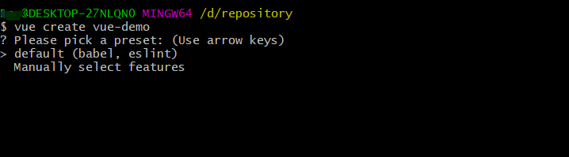
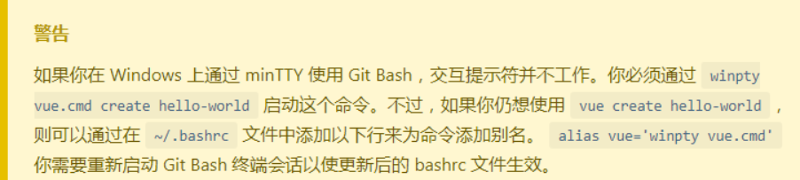
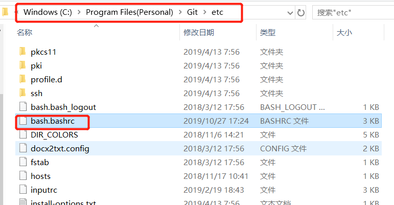

# 一、问题描述
windows用户在`git bash`窗口使用`vue-cli`创建`vue`项目，在执行`vue create project-name`命令后，选择初始化配置时，需要选择默认模式和手动模式，提示使用键盘上下键进行选择，但在`git bash`中上下键选择无效。见下图：


# 二、问题原因
vue-cli官网解释：


# 三、处理方式
1、 使用如下命令配置
```bash
  winpty vue.cmd create vue-demo
```

2、在git安装目录下添加如下配置
* 选择git bash 的安装目录，找到bash.bashrc文件



* 打开该文件，在末尾添加:alias vue='winpty vue.cmd'
* 重启git bash

3、直接使用windows自带的powershell创建项目

使用以上三种方式，再创建项目时都可以使用箭头方向键选择手动模式，然后使用`空格键`选择你要的配置就可以了。