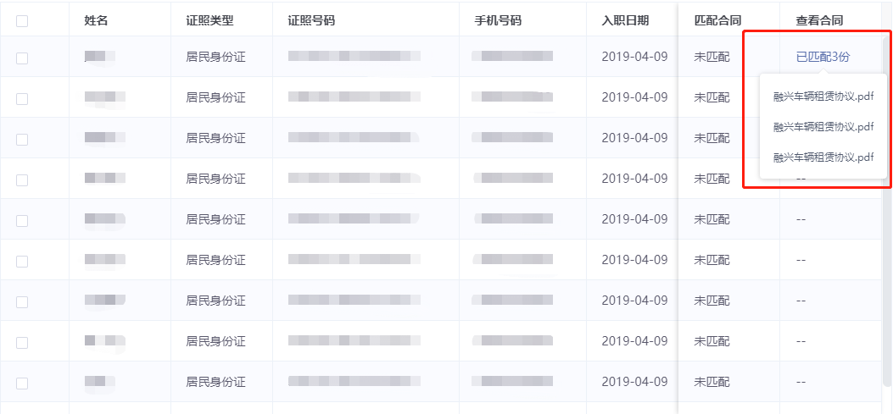

> iView是基于vue.js优秀的UI框架，使用范围非常广泛。博主在使用过后有种再也离不开的感觉【捂脸】。尤其是Table组件的render函数，大大丰富了表格的可扩展性。为了更加全面的使用组件的便利性，在render函数中也经常会嵌套使用到其他组件，不过文档并没有详细的使用指导，自己在使用的时候也是经过了一阵摸索，这里就将常用的几个记录一下，权且当作备忘录，也希望给有需要的人一点指导吧。

## 1、Poptip组件
* 图示

  

* 使用

```javascript
columns: [{
  title: '查看合同',
  width: 120,
  key: 'contractList',
  fixed: 'right',
  render: (h, params) => {
    if (params.row.contractList.length > 0) {
      return h('poptip',{
        style: {
          width: '200px'
        },
        props: {
          trigger:"hover",
          placement: 'bottom',
          // 注意一定要添加该属性，否则表格会遮盖住气泡浮框
          transfer: true
        }
      },[
        h('span',{
          style: {
            color: '#5B70AB',
            cursor: 'pointer'
          }
        },`已匹配${params.row.contractList.length}份`),
        h('div',{
          slot: 'content'
        },[
          h('ul',[
            params.row.contractList.map(item => {
              return h('li',{
                style: {
                  lineHeight: '36px',
                  cursor: 'pointer'
                },
                on: {
                  click: async() => {
                    let data = {
                      contractNo: item.id
                    }
                    let res = await getFiles(qs.stringify(data))
                    if(res.code === 10200 && res.data.data) {
                      window.open(res.data.data)
                    } else {
                      this.$Modal.error({
                        title: '错误',
                        content: res.message
                      })
                    }
                  }
                }
              },item.fileName)
            })
          ])
        ])
      ])
    } else {
      return h('div','--')
    }
  }
}]
```
## 2、Switch组件
* 图示

  

* 使用

```javascript
columns: [{
  title: "是否启用",
  key: "status",
  width: 100,
  render: (h, params) => {
    let status = params.row.status === 1 ? true : false;
    let _this = this;
    return h("i-switch", {
      props: {
        // 开关的值
        value: status
      },
      on: {
        "on-change": value => {
          params.row.status = value ? 1 : 0;
          _this.handelSwitch(params.row.status);
        }
      }
    });
  },
  fixed: "right"
}]
```
## 3、Input组件
* 使用

```javascript
columns: [{
  title: '标记金额',
  key: "amount",
  width: 150,
  render: (h, params) => {
    return h('Input',{
      props: {
        // 输入框值
        value: ''
      },
      on: {
        // 监听输入事件，赋值
        input: (val) => {
          this.data[params.index].amount = val
        },
        // 焦点事件
        'on-blur':() => {

        }
      }
    })
  }
}]
```

## 4、Select组件
* 使用

 ```javascript
columns: [{
  title: '职位',
  key: "position",
  width: 150,
  render: (h, params) => {
    return h('Select',{
      on: {
        // 选中赋值
        'on-change': (val) => {
            this.data[params.index].position = val
        }
      },
      // 根据数据渲染下拉
      params.row.positionList.map((item) => {
        return h('Option', {
          props: {
            value: item.value,
            label: item.name
          }
        })
      })
    })
  }
}]
  ```

以上，列出了几种常见的在render函数中使用的组件，主要是一些细节，根据自己的业务需求，再配合`vue.js`官方文件关于`渲染函数 & JSX`的介绍，就可以融汇贯通的使用了。附上文档链接：- [渲染函数 & JSX](https://cn.vuejs.org/v2/guide/render-function.html)。当然，你也可以使用Table组件中的`template`模板达到嵌套使用组件的目的。我们这里只讲使用render函数的方式，就不做过度的赘述。