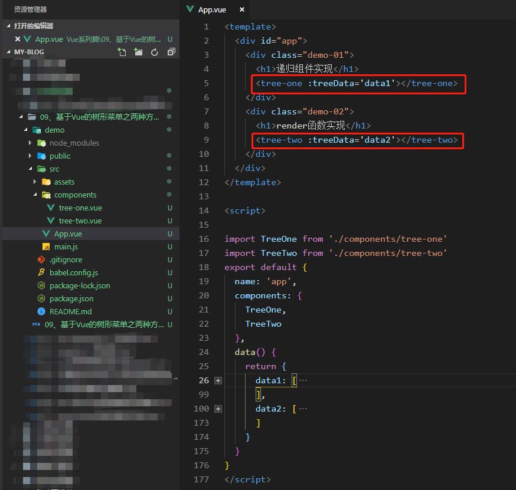
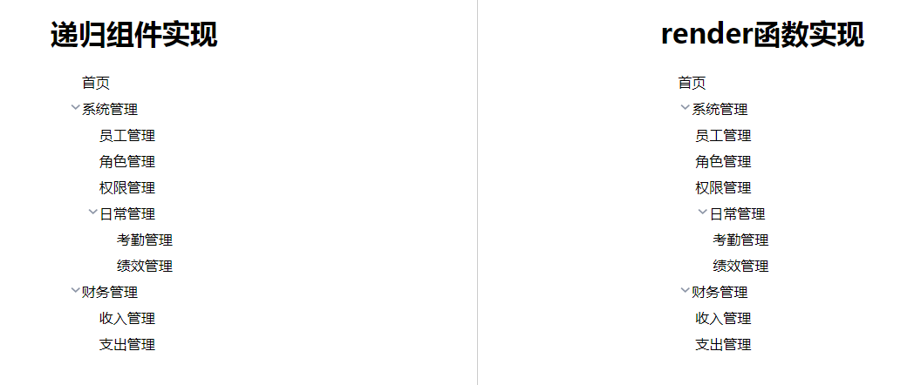

> 树形菜单是开发后台管理系统都绕不过的一个需求，也是各种UI框架都必须具备的组件。实际开发中，大多数时候都是直接拿别人的轮子过来用，但作为一个有追求的程序猿怎么能不知道轮子背后的东西呢？今天，我就基于Vue用两种方式来实现树形菜单。

# 准备工作
* Vue开发环境
  
* 树形结构的数据
  ```json
  data: [
    {
      name: 'home',
      path: '/home',
      isExpand: false,
      meta: { text: '首页' }
    },
    {
      name: 'manage',
      path: '/manage',
      isExpand: false,
      meta: {text: '系统管理'},
      children: [
        {
          name: 'staff',
          path: 'staff',
          isExpand: false,
          meta: {text: '员工管理'}
        },
        {
          name: 'role',
          path: 'role',
          isExpand: false,
          meta: {text: '角色管理'}
        },
        {
          name: 'auth',
          path: 'auth',
          isExpand: false,
          meta: {text: '权限管理'}
        },
        {
          name: 'daily',
          path: 'daily',
          isExpand: false,
          meta: {text: '日常管理'},
          children: [
            {
              name: 'attendance',
              path: 'attendance',
              isExpand: false,
              meta: {text: '考勤管理'},
            },
            {
              name: 'performance',
              path: 'performance',
              isExpand: false,
              meta: {text: '绩效管理'}
            }
          ]
        }
      ]
    },
    {
      name: 'finance',
      path: '/finance',
      isExpand: false,
      meta: {text: '财务管理'},
      children: [
        {
          name: 'income',
          path: 'income',
          isExpand: false,
          meta: {text: '收入管理'},
        },
        {
          name: 'expense',
          path: 'expense',
          isExpand: false,
          meta: {text: '支出管理'},
        }
      ]
    }
  ]
  ```
# 两种实现
## 1、递归组件
  ```html
  // 子组件
  <template>
    <ul>
      <li v-for="(item, index) in treeData" :key="index" :class="{'active':!(item.children && item.children.length > 0)}">
        <span class='item'>
          <span class="icon" @click="item.isExpand = !item.isExpand">
             0 && !item.isExpand" src="../assets/img/icon_arrow_right.png">
             0 && item.isExpand" src="../assets/img/icon_arrow_down.png">
          </span>
          <span class="title"
            @click="handleClick(item)">{{item.meta.text}}</span>
        </span>
        <!-- 递归组件 -->
        <tree-one v-show="item.isExpand" v-if="item.children && item.children.length > 0" :treeData="item.children"></tree-one>
      </li>
    </ul>
  </template>
  <script>
  export default {
    name: 'TreeOne',
    props: {
      treeData: {
        type: Array,
        default: () => {
          return []
        }
      }
    },
    methods: {
      handleClick(){}
    }
  }
  </script>
  ```

## 2、render函数
  ```javascript
  // 子组件
  <script>
    import img1  from '../assets/img/icon_arrow_right.png'
    import img2 from '../assets/img/icon_arrow_down.png'
    export default {
      name: 'TreeTwo',
      props: {
        treeData: {
          type: Array,
          default: () => {
            return []
          }
        }
      },
      render(r){
        return this.elements(this.treeData,r)
      },
      methods: {
        elements(data,r){
          return r('ul',[
            data.map(item => {
              if (item.children && item.children.length > 0) {
                return r('li',{
                  'class': {
                    active: !(item.children && item.children.length > 0)
                  }
                },[
                  r('span',{
                    'class':'item'
                  },[
                    r('span',{
                      'class': 'icon',
                      on:{
                        click: () => {
                          item.isExpand = !item.isExpand
                        }
                      }
                    },[
                      r('img',{
                        attrs: {
                          src: item.children && item.children.length > 0 && !item.isExpand ? 
                          img1 : (item.children && item.children.length > 0 && item.isExpand ? img2 : '')
                        }
                      })
                    ]),
                    r('span',{
                      'class': 'title',
                      on: {
                        click: () => {
                          
                        }
                      }
                    },item.meta.text,)
                  ]),
                  // 递归调用
                  item.isExpand ? this.elements(item.children,r): null
                ])
              } else {
                return r('li',item.meta.text)
              }
            })
          ])
        }
      }
    }
  </script>
  ```

  # 实现效果
  

  以上就是用两种方式实现的树组件，重点在于递归的思想，希望对读者有所帮助。详情可以查看源代码：[源码]('https://github.com/Wu-Zhichao/my-blog/tree/master/Vue%E7%B3%BB%E5%88%97%E7%AF%87/09%E3%80%81%E5%9F%BA%E4%BA%8EVue%E7%9A%84%E6%A0%91%E5%BD%A2%E8%8F%9C%E5%8D%95%E4%B9%8B%E4%B8%A4%E7%A7%8D%E6%96%B9%E5%BC%8F%E5%AE%9E%E7%8E%B0/demo')
