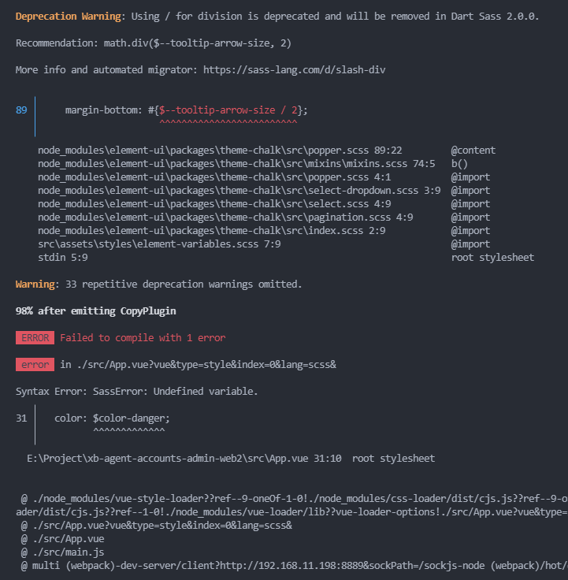
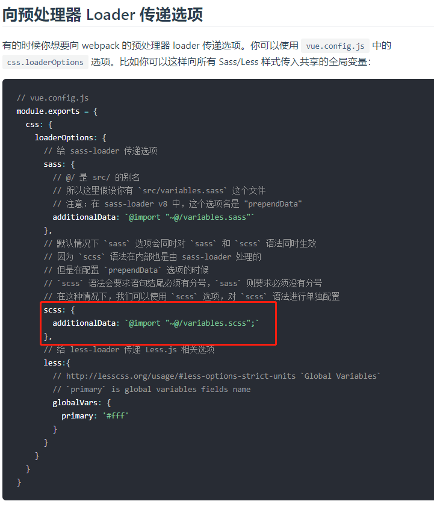
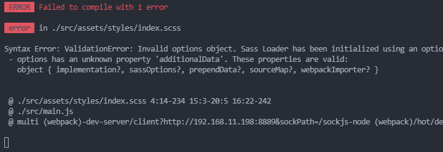
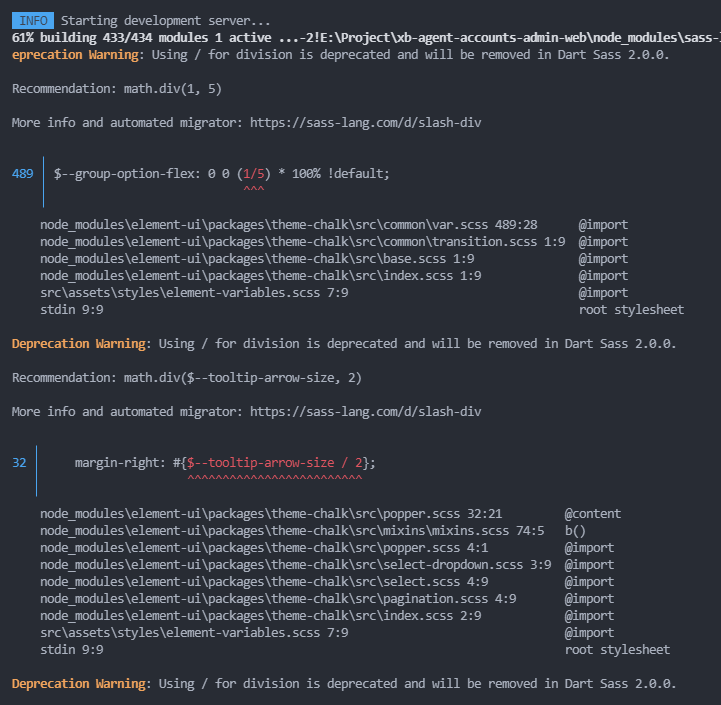
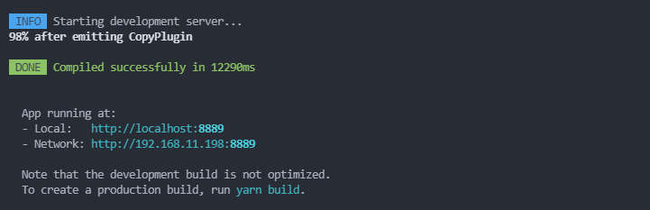
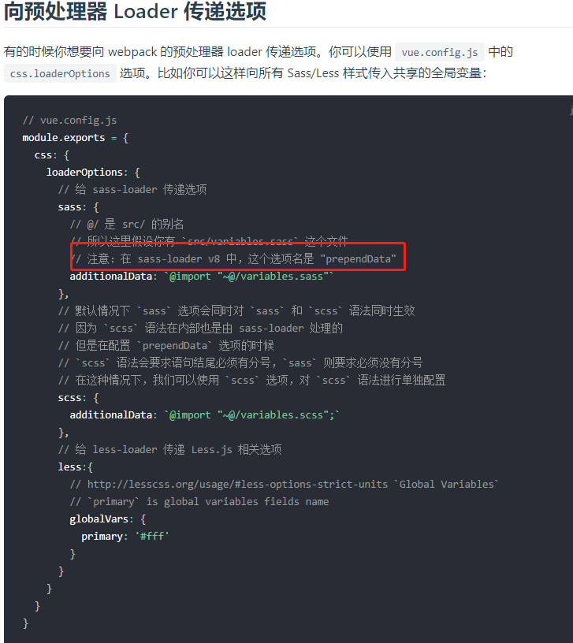

在前端开发项目中，`sass`是一个很好的编写样式的预处理工具，但是集成到`VueCli`中以后坑还是很多的。如果想要在项目入口文件`main.js`中引入，然后可以全局使用，会报各种各样的错。下面就记录一下自己的踩坑经历吧。
- VueCli生成项目集成插件版本
```json
  "dependencies": {
    "core-js": "^3.6.5",
    "vue": "^2.6.11",
    "vue-router": "^3.2.0",
    "vuex": "^3.4.0"
  },
  "devDependencies": {
    "@vue/cli-plugin-eslint": "~4.5.0",
    "@vue/cli-plugin-router": "~4.5.0",
    "@vue/cli-plugin-vuex": "~4.5.0",
    "@vue/cli-service": "~4.5.0",
    "@vue/eslint-config-prettier": "^6.0.0",
    "babel-eslint": "^10.1.0",
    "eslint": "^6.7.2",
    "eslint-plugin-prettier": "^3.3.1",
    "eslint-plugin-vue": "^6.2.2",
    "prettier": "^2.2.1",
    "sass": "^1.26.5",
    "sass-loader": "^8.0.2",
    "vue-template-compiler": "^2.6.11"
  }
```

- 我们期待的使用方式：
```js
// index.scss  定义全局变量和混入
@import './variable.scss';
@import './mixin.scss';
@import './element-variables.scss'
// main.js - 全局引入
import Vue from 'vue'
import App from './App.vue'
import router from './router'
import store from './store'
import ElementUI from 'element-ui'
// 全局引入
import '@/assets/styles/index.scss'
Vue.config.productionTip = false
Vue.use(ElementUI)
new Vue({
  router,
  store,
  render: h => h(App)
}).$mount('#app')

// App.vue 使用 全局变量
<template>
  <div id="app">
    <div class="test">测试</div>
  </div>
<template>
 ...
 <style lang="scss">
.test {
  color: $color-danger;
}
</style>
```
但是，报错了！！！`element-ui`也抛出警告！



好吧，那怎么办？只能翻`VueCli`官方文档了~~~

good! 文档有介绍耶！✌



so, 配置一下咯！

在`vue.config.js`文件中增加如下配置：
```js
 css: {
    loaderOptions: {
      scss: {
        additionalData: `
          @import "@/assets/styles/variable.scss";
          @import "@/assets/styles/mixin.scss";
        `
      }
    }
  }
```
这下应该可以了吧！！！'

But, 又报新的错了！



WTF!!!😡😡😡

咦~~~~报错提示配置不对 ❓

不会呀，文档不写着吗？可是就是报错了！！！ 😔

Google一下吧....

好像有人遇到！把配置改成`additionalData`改成`prependData`  ❓
```js
  css: {
    loaderOptions: {
      scss: {
        prependData: `
          @import "@/assets/styles/variable.scss";
          @import "@/assets/styles/mixin.scss";
        `
      }
    }
  },
```
我去！居然可以了！这是什么鬼？官方文档没更新❓

but, `element-ui`的警告还在，强迫症！不能忍啊！！！😢



继续Google...... 

咦，有人说是`sass`版本问题！改到固定版本！
```json
 "sass": "1.26.5",
```

丢！ 真的可以了!😂😘



最爱这个清爽的界面了！唉😘❤🌹💋

but一脸懵逼~~~😢

-------------分割线------------------------------
后续来了~~~~

多读了即便官方文档，发现是自己看漏了，文档有写`sass-loader` `v8` 中，这个选项名是 `prependData`,是我自己看漏了！



但是`sass`版本问题，还是要改到固定版本的哟！！！

逃了~~~~🤣😜