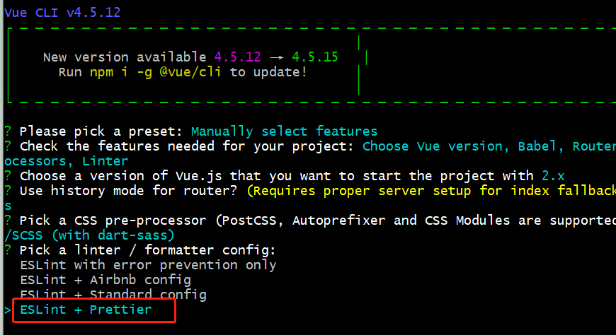

# 1. 前言
最近在做一些团队的开发规范的东西，就顺带研究了下前端使用最广泛的代码校验工具-`ESlint`。实际使用`ESlint`作为代码校验工具已经很久了，但是因为对一个项目是一次配置永久使用的，每次也都是根据网上的资料进行了配置，出了问题也是在网上找解决方案，并没有真正研究过，算是一知半解。今天正好搭了个新项目，就留意了一下使用`VueCli`搭建的项目是如何把`ESlint`集成进去的，以及它是如果起作用的，具有使用到了哪些依赖，以及他们分别都起了什么作用，因此便做个记录。

# 2. 工具集成
在使用`VueCli`创建项目时，勾选`linter`规则，启用`ESlint`，并选择使用`ESlint`+ `Prettier`标准进行代码风格校验。


创建完成后，生成项目的`package.json`文件如下：
```json
{
  "name": "project-name",
  "version": "0.1.0",
  "private": true,
  "scripts": {
    "serve": "vue-cli-service serve --open",
    "build": "vue-cli-service build",
    "lint": "vue-cli-service lint"
  },
  "dependencies": {
    "core-js": "^3.6.5",
    "vue": "^2.6.11",
    "vue-router": "^3.2.0",
    "vuex": "^3.4.0"
  },
  "devDependencies": {
    "@vue/cli-plugin-babel": "~4.5.0",
    "@vue/cli-plugin-eslint": "~4.5.0",
    "@vue/cli-plugin-router": "~4.5.0",
    "@vue/cli-plugin-vuex": "~4.5.0",
    "@vue/cli-service": "~4.5.0",
    "@vue/eslint-config-prettier": "^6.0.0",
    "babel-eslint": "^10.1.0",
    "eslint": "^6.7.2",
    "eslint-plugin-prettier": "^3.3.1",
    "eslint-plugin-vue": "^6.2.2",
    "prettier": "^2.2.1",
    "sass": "^1.26.5",
    "sass-loader": "^8.0.2",
    "vue-template-compiler": "^2.6.11"
  },
  "eslintConfig": {
    "root": true,
    "env": {
      "node": true
    },
    "extends": [
      "plugin:vue/essential",
      "eslint:recommended", 
      "@vue/prettier" 
    ],
    "parserOptions": {
      "parser": "babel-eslint"
    },
    "rules": {}
  },
  "browserslist": [
    "> 1%",
    "last 2 versions",
    "not dead"
  ]
}
```

# 3. 校验配置解析
在我所使用的`VueCli`版本中，项目创建后没有生成`.eslintrc.js`文件，专门针对`ESlint`的配置文件，而是在`package.json`文件中的`eslintConfig`属性中进行配置的。具体如下:
> ps: VueCli在执行规则校验时，首先会在根目录查找是否有.eslintrc.js配置文件，如果有以该文件配置作为项目的ESlint校验规则，如果没有会去package.json文件中找eslintConfig属性的配置。
```json
  "eslintConfig": {  
    // 从项目根目录执行检查
    "root": true,
    // node环境下执行检查
    "env": {
      "node": true
    },
    // 扩展，继承行业优秀方案，相当于集成一个配置集合，优先级是由上往下，有冲突部分，后面的覆盖前面的，rules中的优先级最高
    // 参见eslint官方：http://eslint.cn/docs/user-guide/configuring#extending-configuration-files
    "extends": [
      /* 引入eslint-plugin-vue插件，并开启essential类别中的一系列规则， 仅包含Base Rules和Priority A:Essential,eslint-plugin-vue把所有规则分为四个类别，依次为：base, essential, strongly-recommended, recommended，后面的每个类别都是对前一个类别的拓展。这里默认启用的是essential类别里面的规则，我们也可以使用"plugin:vue/strongly-recommended" 或 "plugin:vue/recommend" 启用更多的规则，如果仅仅想启用strongly-recommended和recommend里面的部分规则，可以在.eslintrc.js文件的rules选项中配置。*/
      "plugin:vue/essential", 
      "@vue/prettier" // 在风格校验时，使用 prettier 来替代 eslint 的格式化功能,启用 Prettier 的规则，依赖eslint-plugin-prettier插件。ps:不规范的地方只提示warning
      // 'plugin:prettier/recommended' // 在风格校验时，使用eslint中prettier扩展作为格式化规范。ps：不规范的地方提示error
    ],
    // 解析器配置
    "parserOptions": {
      // eslint对一些高级特性或者新特性时不支持的，因此可以使用babel-eslint插件对eslint中不支持的需要babel解析的代码进行lint校验
      "parser": "babel-eslint"
    },
    // 配置eslint自定义规则
    "rules": {}
  },
```

# 4. 依赖插件解析
在`package.json`的`script`命令中有一个`lint`命令，执行`npm run lint`会对项目代码进行代码质量和风格检查，并自动修复。
```bash
 "scripts": {
    "serve": "vue-cli-service serve --open",
    "build": "vue-cli-service build",
    // 校验修复命令
    "lint": "vue-cli-service lint"
  },
```
实际上是基于对`@vue/cli-plugin-eslint`的依赖。下面就解析下`VueCli`生成项目的代码检查方面的依赖插件。
```json
   "devDependencies": {
    "@vue/cli-plugin-babel": "~4.5.0",
    // 在vuecli中eslint配置，可以进行Lints 和修复文件，执行vue-cli-service lint时起作用
    "@vue/cli-plugin-eslint": "~4.5.0",
    "@vue/cli-plugin-router": "~4.5.0",
    "@vue/cli-plugin-vuex": "~4.5.0",
    "@vue/cli-service": "~4.5.0",
    // 在vuecli中对eslint-plugin-vue进行配置和扩展,关闭 Eslint 中与 Prettier 冲突的选项，只会关闭冲突的选项，不会启用Prettier的规则
    "@vue/eslint-config-prettier": "^6.0.0",
    // 针对js一些新特性， eslint本身可能不支持，使用babel-eslint可以对所有有效的babel代码进行lint处理。
    "babel-eslint": "^10.1.0",
    "eslint": "^6.7.2",
    //  在使用eslint --fix 时候，实际使用 prettier 来替代 eslint 的格式化功能,启用 Prettier 的规则, extends中的 "@vue/prettier" 依赖该插件
    "eslint-plugin-prettier": "^3.3.1",
    // eslint只能检测.js文件,该插件可以使eslint检查.vue文件的<template> and <script>时可以跟检测js一样，并按照 Vue.js Style Guide 对vue代码进行校验
    "eslint-plugin-vue": "^6.2.2",
    "prettier": "^2.2.1",
    "sass": "^1.26.5",
    "sass-loader": "^8.0.2",
    "vue-template-compiler": "^2.6.11"
  }
```

# 5. 配置是否保存进行校验 
对`VueCli`的项目是可以对自己配置什么时候进行校验的，配置`vue.config.js`文件中的`lintOnSave`属性。
- 默认属性值`default`，即：修改后就会进行编译校验，校验不通过会编译失败，在终端和页面都提示错误信息。当你想要配置保存的时候进行校验
- 设置为`true`时，则保存时会进行编译校验，如果有不符合规范的代码会在控制台进行警告提示，但是页面不会编译失败，页面也不会提示错误信息
- 设置为`false`时，保存时则不会校验，编译也会通过。
```js
module.exports = {
  lintOnSave: true
};
```
`注意`：个人认为这个属性完全不必设置，保留默认值，修改时进行校验，不通过编译失败，页面提示错误信息。我是踩过坑了故此记录一下，我设置为`true`以后，编译通过页面不显示报错信息，找不到哪里的原因，最后发现画蛇添足了。

# 6. 结合VSCode保存自动修复
`VueCli`生成的项目，虽然可以集成`ESlint`+ `Prettier`进行代码质量和风格校验，但是仅仅只能做到对不符合规范的代码进行提示，并且编译失败在终端和页面提示错误信息，如果需要自动修复则需要执行`npm run lint`命令。这在开发的时候时不能忍得，为了进行高效的开发，可以结合`VSCode`进行使用。

在`VSCode`中安装`ESlint`和`Prettier`插件，并进行`setting.json`配置，就可以实现保存自动修复不符合规范代码。配置如下：
```bash
"editor.codeActionsOnSave": {
    "source.fixAll": true,
    "source.fixAll.eslint": true
  },
"files.autoSave": "onFocusChange"
```

尽管`VueCli`集成了`ESlint + Prettier`的配置，但一些默认配置用起来却不是那么令人满意，比如：强制加`;`号、使用`" "`等，如果这不符合我们的编码习惯，完全可以按照自己的喜好进行自定义配置。具体操作：
1. 在项目根目录创建`.eslintrc.js`文件，在里面配置自己的`ESlint`规则
2. 在根目录创建`.prettierrc.js`文件，在里面配置自己的`Prettier`规则

那么，在进行`lint`校验的时候就会首先读取这两个文件的配置，同时`VScode`的`ESlint`和`Prettier`插件校验和自动修复的时候也会优先以这两份文件为准。

- 配置原则：
因为`ESlint`不光可以进行代码质量检查，也可以进行代码风格检查，但是`Prettier`只负责代码风格检查，既然如此，那么配置原则就是： 代码质量相关配置在`.eslintrc.js`, 代码风格相关在`.prettierrc.js`中配置，按照`Prettier`文档一共只有`21`个配置项，这`21`个配置项相关的风格校验就在`.prettierrc.js`文件中配置，相关的校验就不用在`.eslintrc.js`中重复配置，除此`21`项之外的需要配置`ESlint`规则，在`.eslintrc.js`中配置。

# 7. 踩坑
我在折腾的时候，`VSCode`配置了保存自动修复，但是却不是按照本地的`.prettierrc.js`的规则进行修复的，却是按照默认集成的`Prettier`规则修复，修改`.prettierrc.js`文件配置规则，即使重启项目依然无效，苦思不得其解......

后来我就把`VSCode`关了，然后再重启，居然生效了！

WTF！！！