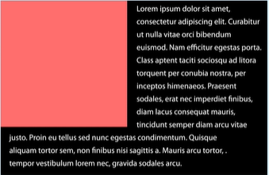
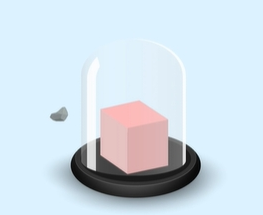
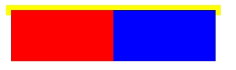
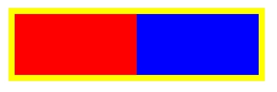
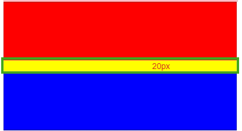
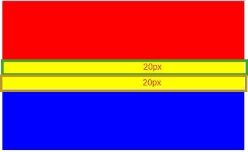

相信大家已经在很多地方看到`BFC`这个概念了，但是对什么是的`BFC`，以及`BFC`有什么用却很模糊，今天就通过本文来揭开`BFC`的神秘面纱。
# 1、为什么会有BFC ?
在理想状态下，我们希望每一个元素都是一个独立的空间打包盒，打包盒外的元素不会受到打包盒内部元素的影响，但事实却并非如此......

相信大家在前端布局的时候，应该经常会遇到以下问题：
- 子元素浮动之后，父元素塌陷。


- 两栏布局，左边固定宽度，右边无法自适应。


- 上下相邻两个设有外边距的元素，实际距离不是两个元素的外边距之和，而是取更大的。


- 一个元素内部，浮动元素会被其他元素环绕。


以上问题，虽然有很多办法可以去解决。

但是从理论上来讲，我们希望每个元素都是一个独立的空间，被包含在父元素里的子元素是不会影响到外面的元素。那么有没有什么方法能够真正让里面的元素和外部真正的隔离开呢？

也许，你可以试试`BFC`。

# 2、BFC是什么 ?
BFC: Block Formating Context（块级格式化上下文）,官方解释为：它决定了元素如何对其内容进行定位，以及与其他元素的关系和相互作用。

BFC的目的就是形成一个独立的空间，让空间中的子元素不会影响到外面的布局。


# 3、如何触发BFC ?
通过上面对`BFC`的认识，我们知道`BFC`就是让元素形成一个独立的空间，空间内的元素不会影响到外面，那么如何才能让元素形成这样一个空间呢？

我们可以通过为元素设置一些CSS属性来让元素形成这样一个空间。也就是通过为元素设置CSS属性来触发元素的`BFC`。

下面我们就列下常用的四种触发`BFC`的规则：
- `float`不为`none`；
- `position`不为`relative`和`static`；
- `overflow`为下`auto`、`scroll`和`hidden`；
- `display`的值为`table-cell`或`inline-block`；

# 4、BFC可以解决什么问题 ?
好啦！通过对`BFC`的学习和了解，上面我们提到的问题，都可以通过触发父元素的`BFC`解决了。

- 解决子元素浮动之后，父元素塌陷

问题：
```html
<div class="parent">
    <div class='child1'></div>
    <div class='child1'></div>
</div>
...
<style>
.parent{
    width: 400px;
    background: yellow;
    padding: 10px;
}
.child1{
    width: 200px;
    height: 100px;
    background-color: red;
    float: left;
}
.child2{
    width: 200px;
    height: 100px;
    background-color: blue;
    float: left;
}
</style>
```

解决：
```css
<style>
.parent{
    width: 400px;
    background: yellow;
    padding: 10px;
    // 触发bfc
    overflow: hidden; // 方式一
    /* display: inline-block; */ // 方式二
    /* display: table-cell; */ // 方式三
    /* position: absolute; */ // 方式四
    /* float: left; */ // 方式五
}
.child1{
    width: 200px;
    height: 100px;
    background-color: red;
    float: left;
}
.child2{
    width: 200px;
    height: 100px;
    background-color: blue;
    float: left;
}
</style>
```


- 解决浮动元素被其他元素环绕

问题：
```html
<div class="box">
    </img>
    <div class="text">Lorem ipsum dolor sit amet consectetur adipisicing elit. Maiores nisi in non tempora, quisquam corrupti eligendi laudantium, veniam reiciendis exercitationem expedita porro inventore maxime aliquam ipsum sequi voluptas amet. Recusandae.</div>
</div>
...
<style>
.box{
    width: 400px;
    height: 300px;
    background:pink;
    border: 1px solid #ccc;
}
.img{
    width: 200px;
    height: 210px;
    float: left;
}
</style>
```


解决：
```css
<style>
.box{
    width: 400px;
    height: 300px;
    background:pink;
    border: 1px solid #ccc;
}
.img{
    width: 200px;
    height: 210px;
    float: left;
}
.text{
    // 触发bfc
    overflow: hidden;
}
</style>
```


- 解决外边距重叠问题

问题：
```html
 <div class="parent">
    <div class="child1"></div>
    <div class="child2"></div>
</div>
...
<style>
.parent{
    width: 400px;
    background: yellow;
}
.child1{
    width: 400px;
    height: 100px;
    background-color: red;
    margin-bottom: 20px;
}
.child2{
    width: 400px;
    height: 100px;
    background-color: blue;
    margin-top: 20px;
}
</style>
```


解决：
```css
.parent{
    width: 400px;
    background: yellow;
}
.child1{
    width: 400px;
    height: 100px;
    background-color: red;
    margin-bottom: 20px;
    /*  触发bfc */
    display: inline-block;
}
.child2{
    width: 400px;
    height: 100px;
    background-color: blue;
    margin-top: 20px;
}
```


至此，`BFC`就介绍完毕了，想必大家已经有一个完成清晰的认识了！


