本系列上一篇主要讲了利用Nginx进行简单的静态资源部署，这种方式需要在代码更新以后手动的把代码重新上传到服务器进行部署，方式比较原始。在现代的敏捷式的软件开发和管理中，产品需要快速的进行更新和迭代，传统的迭代和交付方式已无法满足现实的需要。因此，一种新的交付和部署方式就产生了，简称为CI、CD。

# 1、CI/CD和Jenkins的基本认识
CI/CD 是一种通过在应用开发阶段引入自动化来频繁向客户交付应用的方法。CI/CD 的核心概念是持续集成、持续交付和持续部署。
“CI”始终指持续集成，它属于开发人员的自动化流程。成功的 CI 意味着应用代码的新更改会定期构建、测试并合并到共享存储库中。该解决方案可以解决在一次开发中有太多应用分支，从而导致相互冲突的问题。
“CD”指的是持续交付和/或持续部署，指的是自动将开发人员的更改从存储库发布到生产环境，以供客户使用。它主要为了解决因手动流程降低应用交付速度，从而使运维团队超负荷的问题。
“Jenkins”则是在进行CI/CD的工具之一，也是在进行项目持续集成和部署最常用的工具。

# 2、创建待部署的项目并推送至远程仓库
## 2.1、使用Vue-Cli创建一个待部署的Vue项目
* 全局安装vue/@cli
```bash
  npm install -g vue@cli
```
* 使用vue/@cli创建项目
```bash
  vue create jenkins-demo
```
* 运行项目
```bash
  cd jenkins-demo
  npm run serve
```
此时，在浏览器url输入localhost:8080就可以访问到刚才创建的初始化项目了。

## 2.2、创建一个远程仓库并将项目代码推送至远程仓库
* 在码云/github/gitlab上创建一个项目
* 在本地项目文件夹下执行如下命令，将本地仓库和远程仓库进行关联
```bash
  git remote add origin https://gitee.com/Ron_wu/jenkins-demo.git
```
* 将本地仓库代码推送到远程仓库
```bash
  git push origin master
```

# 3、使用Jenkins进行持续集成
## 3.1、Jenkins环境搭建
* 准备工作
阿里云服务器一台，我这里是使用的是`aliyun Centos 7`，并使用`XShell`登录阿里云服务器。

* 安装Java JDK
`jenkins`工具是由`java`编写的，依赖于`java`环境，因此需要安装`java jdk`。
```bash
// 进入cd usr/local/src/ 目录
cd usr/local/src/
// 下载jak
wget http://img.zhufengpeixun.cn/jdk1.8.0_211.tar.gz
// 查看是否下载成功,如果看到有jdk1.8.0_211.tar.gz的压缩文件表示下载成功
ls
// 解压 - x(解压)z(gzip包)v(显示解压过程)f(指定压缩包名字)
tar -xzvf jdk1.8.0_211.tar.gz
// 在/usr目录下创建java文件夹存放java文件
mkdir /usr/java
// 将解压后的文件夹拷贝到/usr/java目录下,-r 表示拷贝文件夹
cp -r jdk1.8.0_211 /usr/java
// 建立软链接 
// 建立软链接后可以不用配环境变量，指定一个路径到bin目录，在任何目录执行java命令时会默认去找/usr/bin/java目录，但是该目录没有jdk，就会找不到，通过软连接的方式，当执行java命令会去/usr/java/jdk1.8.0_22/bin/java
ln -s /usr/java/jdk1.8.0_211/bin/java /usr/bin/java
```
* 安装Jenkins
```bash
// 添加jenkins安装源
wget -O /etc/yum.repos.d/jenkins.repo https://pkg.jenkins.io/redhat-stable/jenkins.repo
// 导入key验证安装源是否合法
rpm --import https://pkg.jenkins.io/redhat-stable/jenkins.io.key
// 安装
yum install -y jenkins 
```
* 启动Jenkins
```bash
service jenkins start
```
* 查看Jenkins是否启动成功

执行启动命令`service jenkins start`后，正常会是下面的状态：
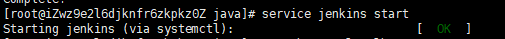
也可以通过如下命令查看：
```bash
service jenkins status
```
显示如下则为启动成功：
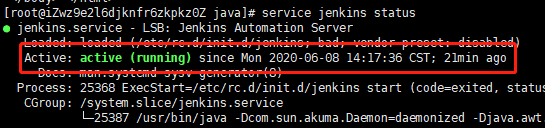

然后，就可以在浏览器通过`ip`访问了，默认是`8080`端口，如`8080`端口未被占用，通过`ip`访问会出现以下界面：
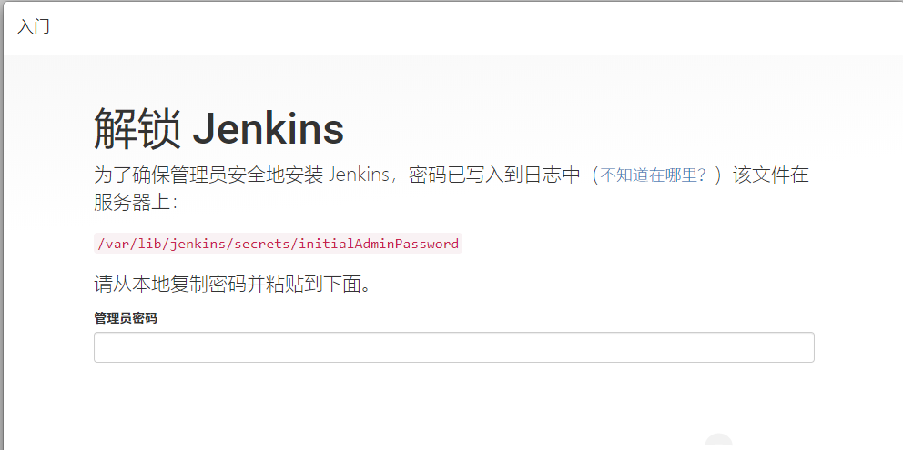

* 查看端口是否被占用

如通过`ip`无法访问，则可通过以下命令查看`8080`端口是否被占用：
```bash
netstat -ntlp
```

* 修改默认端口
如果`80`端口被占用，则需要修改`jenkins`默认端口号。`jenkins`配置文件默认安装在`/etc/sysconfig/jenkins`,通过`vim`编辑器打开即可修改。
```bash
vim /etc/sysconfig/jenkins
```
进行如下修改：
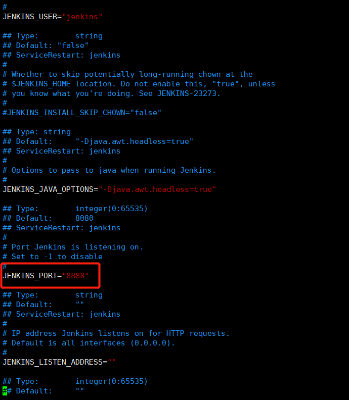

保存后执行重启命令：
```bash
service jenkins restart
```
然后在浏览器通过`ip:端口号`访问即可出现上面解锁界面，则说明端口号修改成功。

`ps`：如果还是无法访问，则要查看阿里云的安全策略组端口是否开放，如果没有开放给则需要登录阿里云后台配置安全策略组开放对应端口。

* 获取解锁密码
`jenkins`初始页面的解锁密码放在`/var/lib/jenkins/secrets/initialAdminPassword`文件内，通过`vim`编辑器打开查看。
```bash
vim /var/lib/jenkins/secrets/initialAdminPassword
```
将获取到的密码填入浏览器`jenkins`初始页面的密码输入框内，点击继续即可进入到`jenkins`插件配置界面。
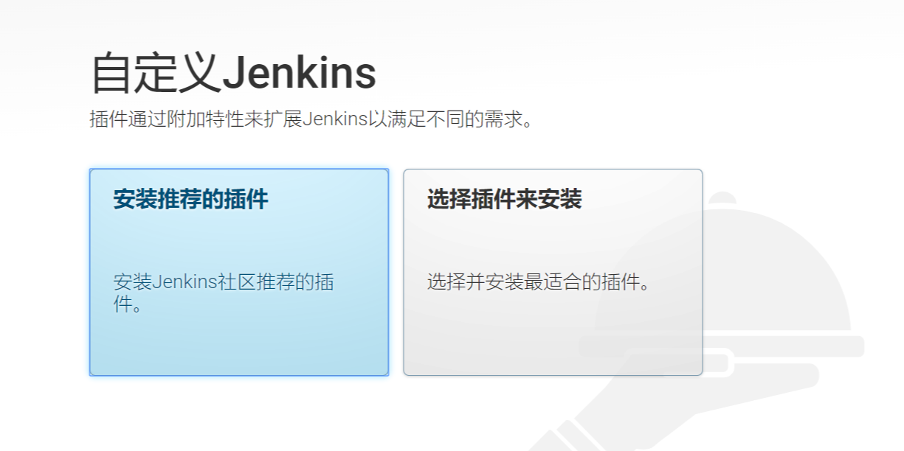

## 3.2、Jenkins插件配置
为了更加清楚的知道`Jenkins`常用的插件有哪些，以及每个插件的作用，我们这里这里选择第二个选项`选择插件来安装`，选择之后会进入到一个选择安装插件的界面，这里我们也选择`无`，具体需要是由的插件我们后续可以通过管理页面去安装，选择`继续`后，就出现了下面创建第一个用户的界面：
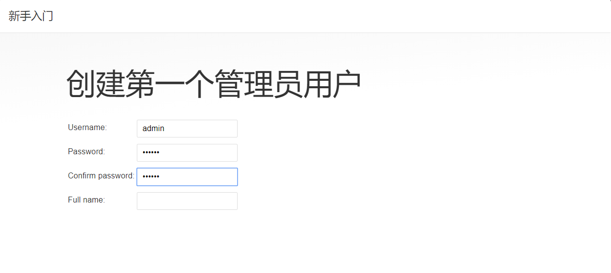 

我们创建一个`admin`账户并设置密码，然后保存就进入`Jenkins`就绪页面。
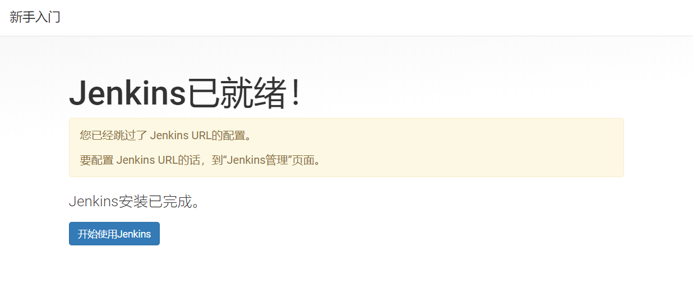

点击`开始使用Jenkins`后就默认使用`admin`账号登录进入到主界面。
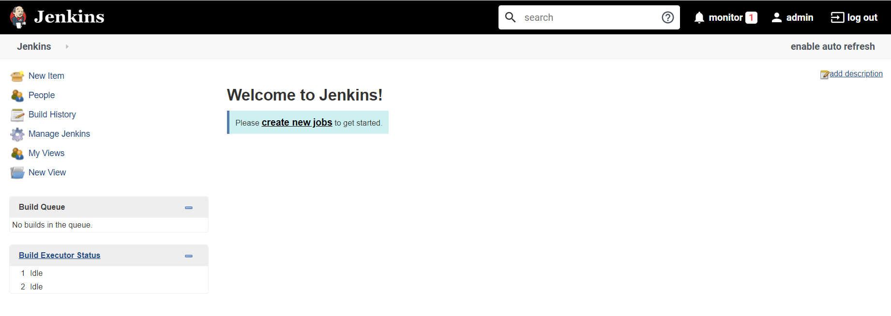

`Jenkins`其实只是一个平台，实现不同功能主要依靠的是插件，下面我们就来了解下，使用`Jenkins`构建必不可少的插件。安装插件可在如下路径操作：
`Manage Jenkins` -> `Manage Plugins` 界面，我们之前进入时是`选择插件来安装`,所以默认是没有任何插件的。
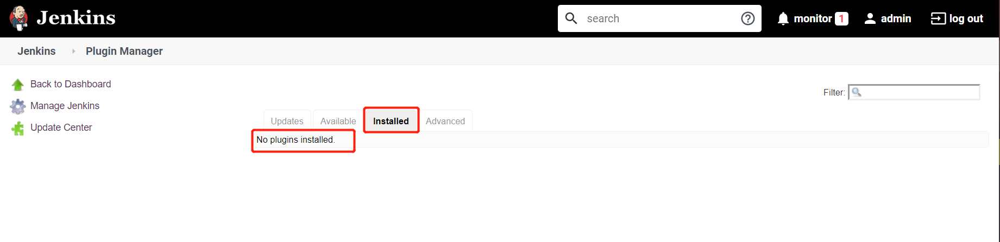

需要使用的插件，我们需要通过搜索框搜索自己需要的插件来安装。
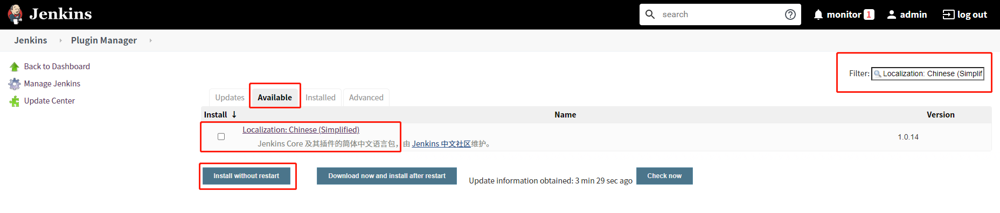

* Locale 
汉化插件，`Jenkins`默认是英文界面，如果需要使用中文界面就需要安装此插件。
安装完成之后，进入到`Manage Jenkins->Configure System`界面，你会发现多了`Local`一栏，进行如下设置：

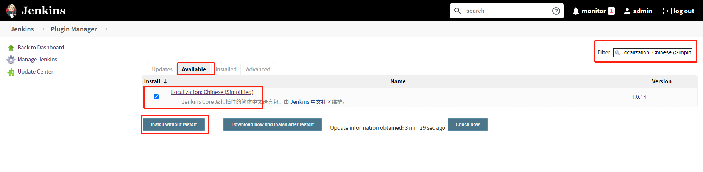

然后点击`save`保存，在浏览器地址栏端口号后加上`/restart`重启`Jenkins`即可，也可以通过命令行`service jenkins restart`重启。

  `ps`这个插件需要依赖到其他插件，因此安装完之后你会发现已安装界面有很多不认识的插件，不用管它们。


